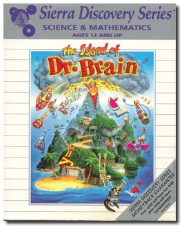
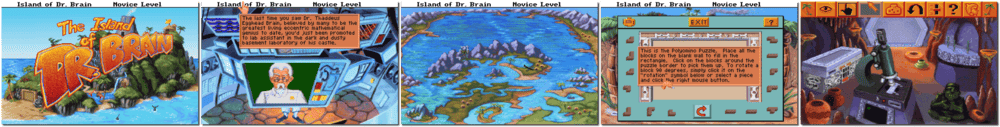

# The Island of Dr. Brain

「**Dr. Brain 2**」

> ❝ In the sequel to Castle of Dr Brain, you will have to assist Dr Brain in retrieving a battery for one of his experiments - the plans were stolen by Dr Brain's archrival scientist. To beat the scientist, you tour the Island of Dr Brain to search for the elusive battery. On your way, you will have to solve puzzles with various difficulty levels; and even find a use for a bunch of pink flamingoes! ❞
>

📌 ┃ **Year** ‣ 1992 ┃ **Genre** ‣ Educational • Puzzle ┃ **Platform** ‣ DOS ┃ **License** ‣ Abandonware ┃ **Category** ‣ 1st-person • 3rd-person ┃ **Media** ‣ Floppy Disk ┃ **Patched • Copy Protection** 

📦 ┃ **[DOSBox](https://www.dosbox.com/) 🟩** ┃ **[DOSBox Staging](https://dosbox-staging.github.io/) 🟩** ┃ **[DOSBox-X](https://dosbox-x.com/) 🟩** 

📎 ┃ **[Wikipedia](https://en.wikipedia.org/wiki/The_Island_of_Dr._Brain)** ┃ **[MobyGames](https://www.mobygames.com/game/1524/the-island-of-dr-brain/)** ┃ **[AbandonwareDOS](https://www.abandonwaredos.com/abandonware-game.php?abandonware=The+Island+of+Dr.+Brain&gid=1256)** ┃ **[MyAbandonware](https://www.myabandonware.com/game/the-island-of-dr-brain-1j6)** ┃ **[Series](https://en.wikipedia.org/wiki/Dr._Brain)** ┃ **Manual** ‣ [Games Database](https://www.gamesdatabase.org/game/microsoft-dos/island-of-dr-brain) 

## Installation Notes
- Use the default **drive** and **directory** for the installation location.
  - Please type the letter of the hard drive to which you want to install this game: Press `C`.
- Music: **Sound Blaster / AdLib Card (or compatibles)**.
- Accept these choices and begin installation.
- Would you like to **(I)nstall** or **(E)xit**? Press `I`.

## Additional Notes
- Consult `Assets/manual.pdf` for the game copy protection.

