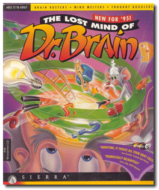
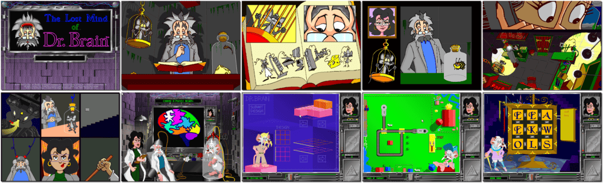

# The Lost Mind of Dr. Brain

「**Dr. Brain 3**」

> ❝ What a headache! Twist It, Shake It and Wake Up Your Brain! Oops! In a bizarre laboratory accident, Dr Brain's mind gets mixed up with his lab rat, and the results are mind-boggling! Now, Dr Brain's destiny is in your hands. Unlock the secrets hiding deep within his eccentric mind as you puzzle over the twists and turns packed into over a thousand wild, wacky, brain-busting adventures! ❞
>

📌 ┃ **Year** ‣ 1995 ┃ **Genre** ‣ Educational • Puzzle ┃ **Platform** ‣ Windows 3.1x ┃ **License** ‣ Abandonware ┃ **Category** ‣ Graphics • Math • Science ┃ **Media** ‣ CD-ROM ┃ **In-Game Manual** 

📦 ┃ **[DOSBox](https://www.dosbox.com/) 🟩** ┃ **[DOSBox Staging](https://dosbox-staging.github.io/) 🟩** ┃ **[DOSBox-X](https://dosbox-x.com/) 🟩** 

📎 ┃ **[Wikipedia](https://en.wikipedia.org/wiki/The_Lost_Mind_of_Dr._Brain)** ┃ **[MobyGames](https://www.mobygames.com/game/2605/the-lost-mind-of-dr-brain/)** ┃ **[MyAbandonware](https://www.myabandonware.com/game/the-lost-mind-of-dr-brain-3ma)** ┃ **[Series](https://en.wikipedia.org/wiki/Dr._Brain)** 

## Installation Notes
- Click **Install**.
- Do you want to perform this test before installing? Click **No**.
- Click **Yes** on the System Test Results to continue with the installation anyway.
- Use the default **drive** and **directory** for the installation location.
- Warning popup can be ignored (we are not using in Windows 95).
- Click **Exit** to finish installation.
- Exit Windows and DOSBox once the installation is complete (**Program Manager > File > Exit Windows**) and rerun the `Launch` script to start the program.

