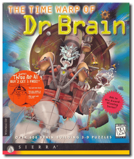
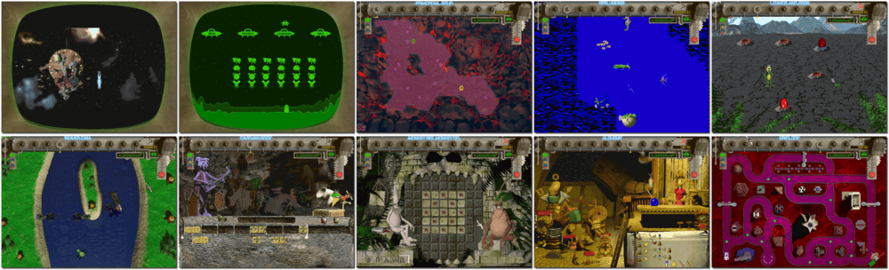

# The Time Warp of Dr. Brain

「**Dr. Brain 4**」

> ❝ Dr Brain gets trapped in the space-time (dis)continuum. Now he needs your brain power to bring him home. Travel through the ages, solve mind-warping puzzles and save Dr Brain just in time! ❞
>

📌 ┃ **Year** ‣ 1996 ┃ **Genre** ‣ Educational • Puzzle ┃ **Platform** ‣ Windows 3.1x ┃ **License** ‣ Abandonware ┃ **Category** ‣ Side view • Graphics • Math • Science ┃ **Media** ‣ CD-ROM ┃ **In-Game Manual** 

📦 ┃ **[DOSBox](https://www.dosbox.com/)** ‣ 0.74-3 🟥 (unplayable) ┃ **[DOSBox Staging](https://dosbox-staging.github.io/)** ‣ 0.80.1 🟥 (unplayable) ┃ **[DOSBox-X](https://dosbox-x.com/) 🟩** 

📎 ┃ **[Wikipedia](https://en.wikipedia.org/wiki/The_Time_Warp_of_Dr._Brain)** ┃ **[MobyGames](https://www.mobygames.com/game/6885/the-time-warp-of-dr-brain/)** ┃ **[MyAbandonware](https://www.myabandonware.com/game/the-time-warp-of-dr-brain-3rf)** ┃ **[Series](https://en.wikipedia.org/wiki/Dr._Brain)** 

## Installation Notes
- Click **Install**.
- Do you want to perform this test before installing? Click **No**.
- Click **Yes** on the System Test Results to continue with the installation anyway.
- Use the default **drive** and **directory** for the installation location.
- On-Line Registration. Click **No**.
- Click **Exit** to finish installation.

## Additional Notes
- The `RUNEXIT.EXE` tool does not work with this program as it requires Windows 3.1x to be fully loaded with Sound Driver stereo sound.
  - Play the game by double-clicking **The Wime Warp of Dr. Brain** icon.
  - Read the game manual by double-clicking **Dr. Brain Help** icon.

