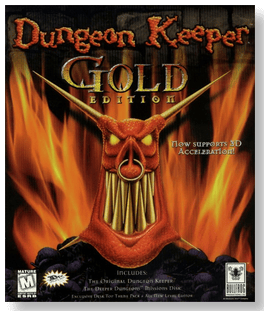
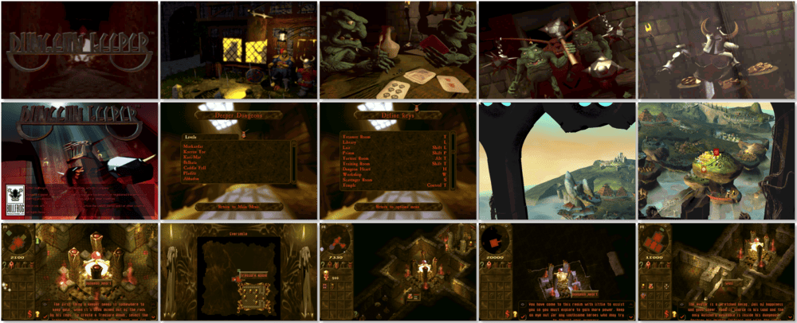

# Dungeon Keeper: Gold Edition

「**Dungeon Keeper** (Base)」「**Dungeon Keeper: The Deeper Dungeons** (Add-on)」「**Dungeon Keeper: Evil is Good**」

> ❝ Your dungeon is dark, foul, and slimy, just the way you like it. You've got a fully stocked torture room, a prison for your helpless captives, and a workshop filled with big uglies cranking out cogs for your war machine. Now you're ready to find some good guys and club the smiles off their shining faces. ❞
>
> ❝ This game **is not abandonware 🚫** and is still for sale on [GOG 💰](https://gog.com/game/dungeon_keeper). ❞
>

📌 ┃ **Year (Dungeon Keeper)** ‣ 1997 ┃ **Year (Dungeon Keeper: The Deeper Dungeons)** ‣ 1997 ┃ **Year (Dungeon Keeper: Gold Edition)** ‣ 1998 ┃ **Genre** ‣ Strategy ┃ **Platform** ‣ DOS ┃ **License** ‣ Proprietary ┃ **Media** ‣ CD-ROM 

📦 ┃ **[DOSBox](https://www.dosbox.com/) 🟩** ┃ **[DOSBox Staging](https://dosbox-staging.github.io/) 🟩** ┃ **[DOSBox-X](https://dosbox-x.com/) 🟩** 

📎 ┃ **Dungeon Keeper** ‣ [Wikipedia](https://en.wikipedia.org/wiki/Dungeon_Keeper) • [MobyGames](https://www.mobygames.com/game/156/dungeon-keeper/) • [MyAbandonware](https://www.myabandonware.com/game/dungeon-keeper-d74) ┃ **Dungeon Keeper: The Deeper Dungeons** ‣ [MobyGames](https://www.mobygames.com/game/1315/dungeon-keeper-the-deeper-dungeons/) ┃ **Dungeon Keeper: Gold Edition** ‣ [MobyGames](https://www.mobygames.com/game/2101/dungeon-keeper-gold-edition/) • [MyAbandonware](https://myabandonware.com/game/dungeon-keeper-gold-edition-d5i) ┃ **[GOG 💰](https://gog.com/game/dungeon_keeper)** 

## Installation Notes
- Installing **Dungeon Keeper**
  - Select your preferred language.
  - Select **Audio Setup** > **Select SFX Card**:
    - Select **Creative Labs Sound Blaster 16 or AWE32** > **Configure Automatically**.
  - Select **Install**.
  - Use the default **drive** and **directory** for the installation location.
  - Select **Quit Setup** to begin *Dungeon Keeper: The Deeper* Dungeons installation.
- Installing **Dungeon Keeper: The Deeper Dungeons**
  - Select your preferred language.
  - Install to directory `C:\KEEPER` and press `ENTER`.

## Additional Notes
- To view *Dungeon Keeper* in high resolution, press `ALT-R` during gameplay.

---

