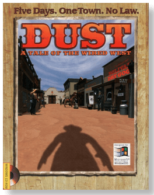
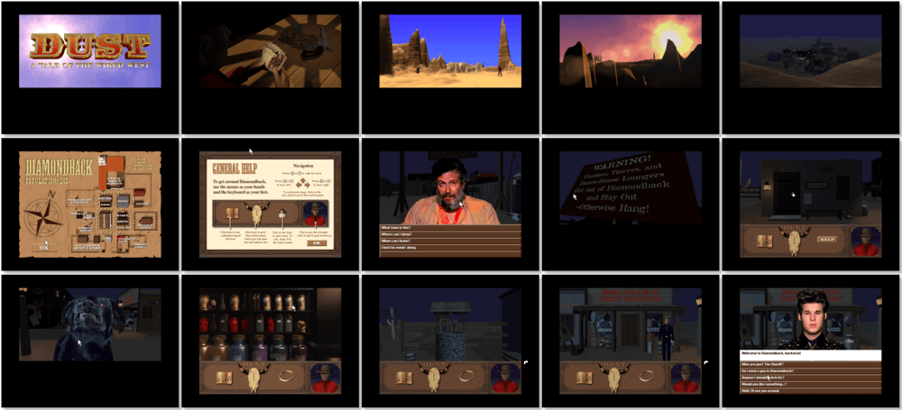

# Dust: A Tale of the Wired West

> ❝ You are stranded somewhere on the digital frontier. On the run, without a friend, a gun, or a past. Just over the horizon is the key to your survival, in the form of Diamondback, a scruffy Old West outpost in 1882 New Mexico. Stroll down Main Street, belly up in the bar, battle gunslingers, or help Native Americans recover their stolen heritage. Whatever you do is up to you. But when rumours surface of lost Spanish silver, mayhem follows. Can you save a hardscrabble band of pioneers from themselves? Or will you succumb to temptation in a town where you are the only law? Boot up and find out. ❞
>

📌 ┃ **Year** ‣ 1995 ┃ **Genre** ‣ Adventure ┃ **Platform** ‣ Windows 3.1x ┃ **License** ‣ Abandonware ┃ **Media** ‣ CD-ROM 

📦 ┃ **[DOSBox](https://www.dosbox.com/)** ‣ 0.74-3 🟥 • Unplayable ┃ **[DOSBox Staging](https://dosbox-staging.github.io/)** ‣ 0.80.1 🟥 • Unplayable ┃ **[DOSBox-X](https://dosbox-x.com/) 🟩** 

📎 ┃ **[Wikipedia](https://en.wikipedia.org/wiki/Dust:_A_Tale_of_the_Wired_West)** ┃ **[MobyGames](https://www.mobygames.com/game/3990/dust-a-tale-of-the-wired-west/)** ┃ **[MyAbandonware](https://www.myabandonware.com/game/dust-a-tale-of-the-wired-west-3jb)** 

## Installation Notes
- Select **Install Dust**.
- Select **Typical** installation option.
- Use the default **drive** and **directory** for the installation location.
- Confirm the next default settings.
- Uncheck both **I want to view the Release Notes now.** and **I want to play Dust now.** options.
- Exit Windows and DOSBox once the installation is complete (**Program Manager > File > Exit Windows**) and rerun the `Launch` script to start the program.

---

