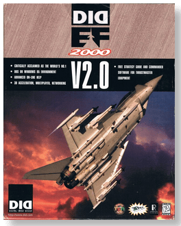
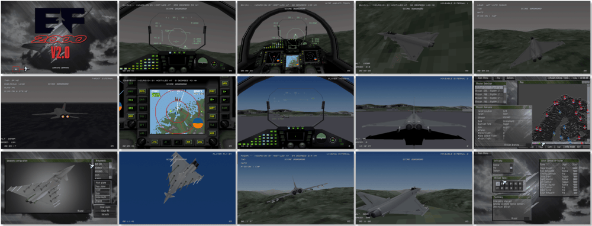

# EF 2000: V2.0

「**EF 2000** (Base)」「**EF 2000: TACTCOM** (Add-on)」「**Eurofighter 2000**」

> ❝ No tactical jet fighter ever created can match the EF2000, NATO's answer to the future of air combat, slated for commission at decade's end. With the aid of the Royal Air Force and British Aerospace, Digital Image Design brings this futuristic aircraft to life right now! ❞
>

📌 ┃ **Year (EF 2000)** ‣ 1995 ┃ **Year (EF 2000: TACTCOM)** ‣ 1996 ┃ **Year (EF 2000: V2.0)** ‣ 1997 ┃ **Genre** ‣ Simulation ┃ **Platform** ‣ DOS ┃ **License** ‣ Abandonware ┃ **Media** ‣ CD-ROM ┃ **Add-on** 

📦 ┃ **[DOSBox](https://www.dosbox.com/) 🟩** ┃ **[DOSBox Staging](https://dosbox-staging.github.io/) 🟩** ┃ **[DOSBox-X](https://dosbox-x.com/) 🟩** 

📎 ┃ **EF 2000** ‣ [Wikipedia](https://en.wikipedia.org/wiki/EF2000_(video_game)) • [MobyGames](https://www.mobygames.com/game/4478/ef-2000/) • [MyAbandonware](https://www.myabandonware.com/game/ef-2000-2rh) ┃ **EF 2000: TACTCOM** ‣ [MobyGames](https://www.mobygames.com/game/6097/ef-2000-tactcom/) • [MyAbandonware](https://www.myabandonware.com/game/ef-2000-tactcom-bca) ┃ **EF 2000: V2.0** ‣ [MobyGames](https://www.mobygames.com/game/58192/ef-2000-v20/) 

## Installation Notes
- Select **Full install of EF2000 V2.0 for DOS**.
- Use the default **drive** and **directory** for the installation location.
- Select **Preferences**:
  - Resolution: **640x480**.
  - Detail: **High**.
  - SFX: **On**.
  - Speech: **On**.
  - Music: **Midi**.
  - Choose MIDI & digital audio drivers:
    - Select and configure MIDI music driver: **Creative Labs Sound Blaster(TM) 16** (*Attempt to configure sound driver automatically*).
    - Select and configure digital audio driver: **Creative Labs Sound Blaster 16 or AWE32** (*Attempt to configure sound driver automatically*).
  - **Save**.
- Select **EXIT CONFIG** and **Quit Installation**.

---

