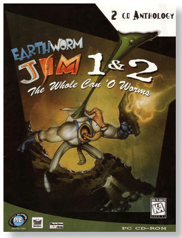
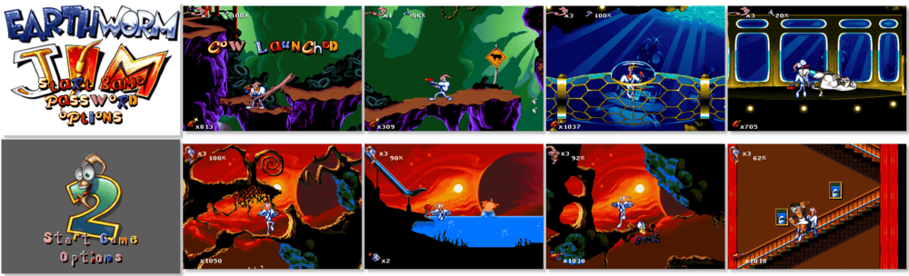

# Earthworm Jim 1+2: The Whole Can 'O Worms

「**Earthworm Jim**」「**Earthworm Jim 2**」

> ❝ Earthworm Jim, a spineless superhero, wriggles back into action as the Groovy Guardian of Goodness in an incredible journey of cheese-curdling proportions. Left unconscious by a massive cow-induced blow to the head and clad in his indestructible, high-tech super suit, Earthworm Jim continues the battle for truth, justice and well-aerated soil. He sure needs you through his 3D fun house of a brain. But beware, there is an evil lurking, a presence in his mind, a dark unseen force at work - Jim's brain is a dangerous place! Whacked-Out Environments: Enter Jim's psyche, where he comes face to face with his fears, happiness, memories and fantasies. ❞ — *Earthworm Jim*
>
> ❝ From Evil the Cat's Circus of the Scars to the planet of Meat, join Jim on a madcap chase across the galaxy. Saving cows, thwarting lawyers and outsmarting Psy-Crow are all in a day's work for Jim. Are you up to the challenge? Can you handle the awesome new weapons? Excellent! Then stop reading this. Take it up to the front counter and try it at home! Trust no one, play it yourself or eat dirt! ❞ — *Earthworm Jim 2*
>
> ❝ This game **is not abandonware 🚫**. **Earthworm Jim** is still for sale on [GOG 💰](https://www.gog.com/en/game/earthworm_jim) and [Steam 💰](https://store.steampowered.com/app/38480/Earthworm_Jim/). **Earthworm Jim 2** is still for sale on [GOG 💰](https://www.gog.com/en/game/earthworm_jim_2) and [Steam 💰](https://store.steampowered.com/app/38490/Earthworm_Jim_2/). ❞
>

📌 ┃ **Year** ‣ 1996 ┃ **Genre** ‣ Action ┃ **Platform** ‣ DOS ┃ **License** ‣ Proprietary ┃ **Media** ‣ CD-ROM ┃ **Compilation** 

📦 ┃ **[DOSBox](https://www.dosbox.com/) 🟩** ┃ **[DOSBox Staging](https://dosbox-staging.github.io/) 🟩** ┃ **[DOSBox-X](https://dosbox-x.com/) 🟩** 

📎 ┃ **Earthworm Jim** ‣ [Wikipedia](https://en.wikipedia.org/wiki/Earthworm_Jim_(video_game)) • [MobyGames](https://www.mobygames.com/game/2927/earthworm-jim/) • [MyAbandonware](https://www.myabandonware.com/game/earthworm-jim-2r1) • [Fandom](https://earthwormjim.fandom.com/wiki/Earthworm_Jim_(Game)) • [GOG 💰](https://www.gog.com/en/game/earthworm_jim) • [Steam 💰](https://store.steampowered.com/app/38480/Earthworm_Jim/) ┃ **Earthworm Jim 2** ‣ [Wikipedia](https://en.wikipedia.org/wiki/Earthworm_Jim_2) • [MobyGames](https://www.mobygames.com/game/373/earthworm-jim-2/) • [MyAbandonware](https://www.myabandonware.com/game/earthworm-jim-2-8d1) • [Fandom](https://earthwormjim.fandom.com/wiki/Earthworm_Jim_2) • [GOG 💰](https://www.gog.com/en/game/earthworm_jim_2) • [Steam 💰](https://store.steampowered.com/app/38490/Earthworm_Jim_2/) ┃ **Earthworm Jim 1+2: The Whole Can 'O Worms** ‣ [MobyGames](https://www.mobygames.com/game/5131/earthworm-jim-1-2-the-whole-can-o-worms/) ┃ **[Series](https://en.wikipedia.org/wiki/Earthworm_Jim)** 

## Additional Notes
- Select playback device: **Sound Blaster Pro**; I/O Port: **220**; Interrupt: **IRQ 7**; DMA Channel: **DMA 1**; Quality: **High Quality**.
- Save and exit.

---

