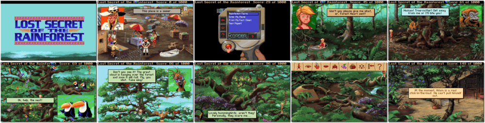

# Lost Secret of the Rainforest

「**EcoQuest 2: Lost Secret of the Rainforest**」「**EcoQuest 2**」

> ❝ Lost Secret of the Rainforest is a trek through lush jungles, mysterious caverns, and ancient ruins atop craggy, mist-covered peaks. This adventure requires that you defeat the real-life dangers threatening the rainforests of South America. As you explore this exotic ecosystem, you will encounter endangered animal species, rare flora, and remote native cultures. Your challenge is to prevent their extinction by poachers and other outlaws who would destroy the environment to satisfy their greed. If you're successful, you will learn the truth behind the enigmatic face of the rainforest. ❞
>

📌 ┃ **Year** ‣ 1993 ┃ **Genre** ‣ Adventure • Educational ┃ **Platform** ‣ DOS ┃ **License** ‣ Abandonware ┃ **Category** ‣ 3rd-person • Graphic adventure • Puzzle elements • Ecology • Detective ┃ **Media** ‣ Compressed Package 

📦 ┃ **[DOSBox](https://www.dosbox.com/) 🟩** ┃ **[DOSBox Staging](https://dosbox-staging.github.io/) 🟩** ┃ **[DOSBox-X](https://dosbox-x.com/) 🟩** 

📎 ┃ **[Wikipedia](https://en.wikipedia.org/wiki/Lost_Secret_of_the_Rainforest)** ┃ **[MobyGames](https://www.mobygames.com/game/619/lost-secret-of-the-rainforest/)** ┃ **[AbandonwareDOS](https://www.abandonwaredos.com/abandonware-game.php?abandonware=EcoQuest+2%3A+Lost+Secret+of+the+Rainforest&gid=2594)** ┃ **[MyAbandonware](https://www.myabandonware.com/game/lost-secret-of-the-rainforest-1rb)** 

