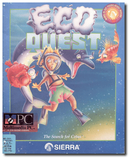
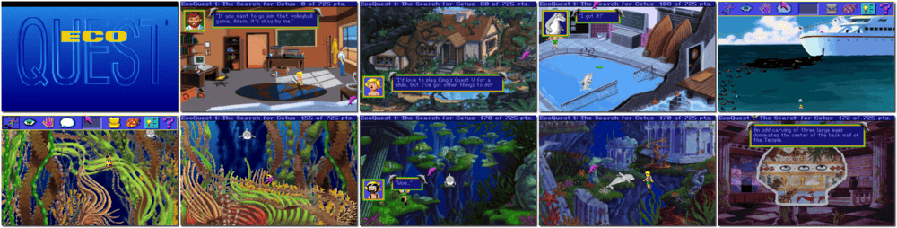

# EcoQuest: The Search for Cetus

「**EcoQuest 1**」

> ❝ Set out on a challenging undersea odyssey as you discover a delicate and miraculous balance of nature. As you unravel this perilous, sub-aquatic quest, you'll learn about the environmental issues facing each of us today. You'll also have the adventure of your life. Join an enchanting cast of animated undersea characters as you search for Cetus, the great whale king. Only you can save a mysterious underwater city. Along the way, you'll explore the ruins of ancient civilizations and rescue sea creatures that got hurt or poisoned by pollution. Join young Adam and Delphineus the dolphin as they brave the terrors of toxic waste, oil spills, deadly driftnets, and other environmental hazards. ❞
>

📌 ┃ **Year** ‣ 1991 ┃ **Genre** ‣ Adventure • Educational ┃ **Platform** ‣ DOS ┃ **License** ‣ Abandonware ┃ **Media** ‣ CD-ROM 

📦 ┃ **[DOSBox](https://www.dosbox.com/) 🟩** ┃ **[DOSBox Staging](https://dosbox-staging.github.io/) 🟩** ┃ **[DOSBox-X](https://dosbox-x.com/) 🟩** 

📎 ┃ **[Wikipedia](https://en.wikipedia.org/wiki/EcoQuest:_The_Search_for_Cetus)** ┃ **[MobyGames](https://www.mobygames.com/game/584/ecoquest-the-search-for-cetus/)** ┃ **[MyAbandonware](https://www.myabandonware.com/game/ecoquest-the-search-for-cetus-1ra)** 

## Installation Notes
- Please type the letter of the hard drive to which you want to install this game: Press `C`.
- Graphics adapter: **VGA or IBM PS2 - 256 Colors**.
- Music: **Sound Blaster / AdLib Card (or compatibles)**.
- Speech/sound effects: **Sound Blaster**.
- Joystick: **Don't use a joystick**.
- Mouse: **Use Microsoft compatible mouse**.
- Memory: **Use your machine's extra memory**.
- Use the default **drive** and **directory** for the installation location.
- Accept these choices and begin installation.
- Do you wish to install everything but the speech files to your hard drive (y/n)? Press `Y`.

---

