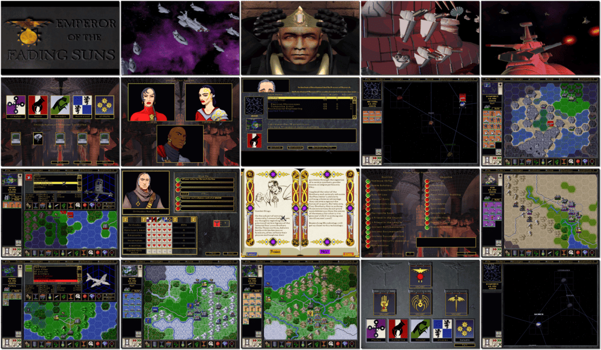

# Emperor of the Fading Suns

> ❝ Enter the realm of the Fading Suns and become meshed in a bold, Gothic world where advanced technology has plunged the galaxy into a new Dark Age. Explore, expand, exploit and exterminate in your ruthless quest to unite the planets and attain the crown of Emperor. Nothing less than the future of the Known Worlds hangs in the balance! ❞
>
> ❝ This game **is not abandonware 🚫**. The **Enhanced Edition** release is available on [GOG 💰](https://www.gog.com/en/game/emperor_of_the_fading_suns) and [Zoom 💰](https://zoom-platform.com/product/emperor-of-the-fading-suns-enhanced-edition). ❞
>

📌 ┃ **Year** ‣ 1996 ┃ **Genre** ‣ Strategy ┃ **Platform** ‣ Windows 9x ┃ **License** ‣ Proprietary ┃ **Media** ‣ CD-ROM ┃ **Patched** ‣ 1.4 

📦 ┃ **[DOSBox](https://www.dosbox.com/) ⬜ • Untested** ┃ **[DOSBox Staging](https://dosbox-staging.github.io/) ⬜ • Untested** ┃ **[DOSBox-X](https://dosbox-x.com/) 🟩** 

📎 ┃ **[Wikipedia](https://en.wikipedia.org/wiki/Emperor_of_the_Fading_Suns)** ┃ **[MobyGames](https://www.mobygames.com/game/789/emperor-of-the-fading-suns/)** ┃ **[MyAbandonware](https://www.myabandonware.com/game/emperor-of-the-fading-suns-3zx)** ┃ **Enhanced Edition** ‣ [GOG 💰](https://www.gog.com/en/game/emperor_of_the_fading_suns) ┃ **Enhanced Edition** ‣ [Zoom 💰](https://zoom-platform.com/product/emperor-of-the-fading-suns-enhanced-edition) 

## Host Requirements
- Download a patch file manually from [MyAbandonware](https://www.myabandonware.com/game/emperor-of-the-fading-suns-3zx) labeled *"Patch 1.4 English version 13 MB (Windows)"*, rename it to `patch.zip`, and place it in the `Assets` directory.

## Installation Notes
- Open *My Computer* and double-click on the `D:` CD-ROM drive to start the installation.
- DirectX is part of the autoplay process, follow along with the installation.
- Use the default **drive** and **directory** for the installation location.
- Applying patches:
  - A patch is available on `C:\PATCH\PATCH.ZIP`. Extract the compressed file and run `SUNS.EXE`.
  - Set the patch destination to `C:\EFS`, and overwrite all existing files when prompted.
  - Click **No** when prompted to run a certain registry file.

---

