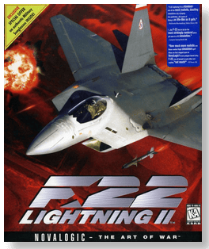
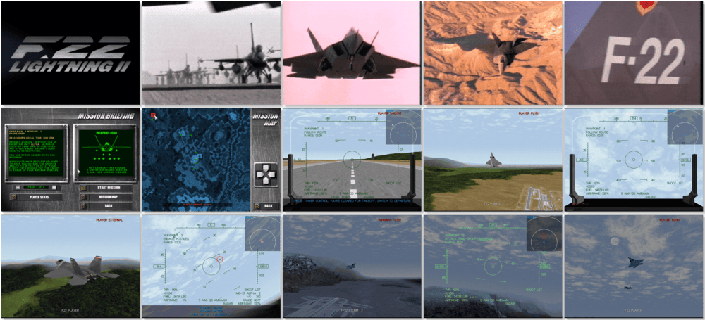

# F-22 Lightning II

> ❝ Roam through the blood-red skies over a vast terrain. Play with life and death. Preferably engage your opponent from behind. You've never experienced anything like this. You'll be amazed by the gameplay of F22 Lightning II, be speechless by the unique graphics and witness it in digital stereo sound. ❞
>

📌 ┃ **Year** ‣ 1996 ┃ **Genre** ‣ Action • Simulation ┃ **Platform** ‣ DOS ┃ **License** ‣ Abandonware ┃ **Media** ‣ CD-ROM 

📦 ┃ **[DOSBox](https://www.dosbox.com/) 🟩** ┃ **[DOSBox Staging](https://dosbox-staging.github.io/) 🟩** ┃ **[DOSBox-X](https://dosbox-x.com/) 🟩** 

📎 ┃ **[Wikipedia](https://en.wikipedia.org/wiki/F-22_Lightning_II)** ┃ **[MobyGames](https://www.mobygames.com/game/2576/f-22-lightning-ii/)** ┃ **[MyAbandonware](https://www.myabandonware.com/game/f-22-lightning-ii-a50)** ┃ **[Series](https://en.wikipedia.org/wiki/F-22_(series))** 

## Installation Notes
- Use the default **drive** and **directory** for the installation location.
- Installation level: **Large Installation (41.6 MB)**.
- F22 Setup Main Menu:
  - Audio Setup - Digital sound device: **Autodetect sound device** • **Perform sound card autodetection**.
  - Audio Setup - Music device: **Soundblaster 16-bit / OPL3**; I/O: **388h**.
  - Performance settings - Turn ON **Use page flipping** and **Use VESA always**.
  - Exit and save settings.

---

