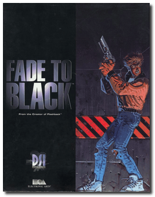

# Fade to Black

「**Flashback 3D**」「**Crossfire**」「**Project Morphs**」

> ❝ Lock and load as you jump into this adrenaline rush. Conrad, the hero from "Flashback", awakes from his cryogenic sleep to find himself in the clutches of his old enemies, the Morphs. With your heart in your throat, battle through the solar system in a three-dimensional environment. Know how to win the confidence of the Ancients, these mysterious people, and discover the powers of the Pyramid. Overcome the terror which invades you in these mazes infested with danger, and exhaust your limits to conquer the Morph invaders. ❞
>

📌 ┃ Year: **1995** ┃ Genre: **Action** ┃ Platform: **DOS** ┃ License: **Abandonware** ┃ Category: **3rd-person • Puzzle elements • Shooter • Sci-fi** ┃ Media: **CD-ROM** 

📦 ┃ **[DOSBox](https://www.dosbox.com/) 🟩** ┃ **[DOSBox Staging](https://dosbox-staging.github.io/) 🟩** ┃ **[DOSBox-X](https://dosbox-x.com/) 🟩** 

📎 ┃ **[Wikipedia](https://en.wikipedia.org/wiki/Fade_to_Black_(video_game))** ┃ **[MobyGames](https://www.mobygames.com/game/3015/fade-to-black/)** ┃ **[AbandonwareDOS](https://www.abandonwaredos.com/abandonware-game.php?abandonware=Fade+to+Black&gid=1559)** ┃ **[MyAbandonware](https://www.myabandonware.com/game/fade-to-black-2ro)** 

## Installation Notes
- Installation of the game: **Maximum Installation**.
  - Use the default **drive** and **directory** for the installation location.
- Sound card selection:
  - SFX card selection: **Creative Labs Sound Blaster 16 or AWE32** (automatic configuration).
  - MIDI card selection: **Creative Labs Sound Blaster(TM) 16** (automatic configuration).
- Resolution selection: **640x400**.
- Controls selection: **Mouse and Keyboard**.

## Additional Notes
- A desktop keyboard with right-hand Ctrl, Shift, and Alt keys is preferred to play this game.

