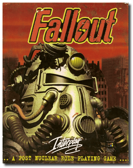
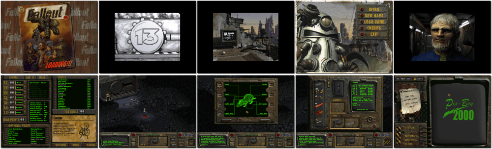

# Fallout

「**Fallout: A GURPS Post-Nuclear Adventure**」「**Fallout: A Post-Nuclear Role-Playing Game**」「**Vault 13: A GURPS Post-Nuclear Adventure**」

> ❝ Our home is in an underground Fallout shelter modified to house 1,000 people indefinitely after a nuclear holocaust. It has been nearly 80 years. We still don't know what's out there. Sure, we've sent out volunteer scouts, but none returned. Now our water recycler has failed. Rationing has begun, but someone needs to leave the vault to get a replacement microchip for the water recycler and look for other survivors. We drew straws. You got the short one. ❞
>
> ❝ This game **is not abandonware 🚫** and is still for sale on [GOG 💰](https://www.gog.com/en/game/fallout) and [Steam 💰](https://store.steampowered.com/app/38400/Fallout_A_Post_Nuclear_Role_Playing_Game/). ❞
>

📌 ┃ **Year** ‣ 1997 ┃ **Genre** ‣ Role-playing ┃ **Platform** ‣ DOS ┃ **License** ‣ Proprietary ┃ **Category** ‣ Diagonal-down • Real-time • Turn-based • Post-apocalyptic ┃ **Media** ‣ CD-ROM ┃ **Patched** 

📦 ┃ **[DOSBox](https://www.dosbox.com/) 🟩** ┃ **[DOSBox Staging](https://dosbox-staging.github.io/) 🟩** ┃ **[DOSBox-X](https://dosbox-x.com/) 🟩** 

📎 ┃ **[Wikipedia](https://en.wikipedia.org/wiki/Fallout_(video_game))** ┃ **[Wikipedia - Fallout Series](https://en.wikipedia.org/wiki/Fallout_(series))** ┃ **[MobyGames](https://www.mobygames.com/game/223/fallout/)** ┃ **[AbandonwareDOS](https://www.abandonwaredos.com/abandonware-game.php?abandonware=Fallout&gid=1513)** ┃ **[MyAbandonware](https://www.myabandonware.com/game/fallout-br3)** ┃ **[Fallout Fandom](https://fallout.fandom.com/wiki/Fallout)** ┃ **[GOG 💰](https://www.gog.com/en/game/fallout)** ┃ **[Steam 💰](https://store.steampowered.com/app/38400/Fallout_A_Post_Nuclear_Role_Playing_Game/)** 

## Installation Notes
- Select **HUMONGOUS INSTALLATION** for the installation type.
- Use the default **drive** and **directory** for the installation location.
- Sound Configuration:
  - Select **Auto Detect Sound Hardware**.
  - Select **Continue with Auto Detection**, and then **Select this sound card**.
  - Select **Yes** to save the changes.

