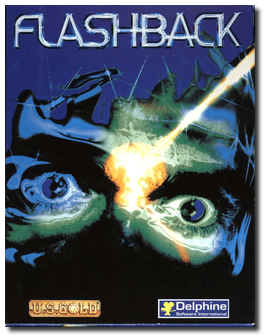
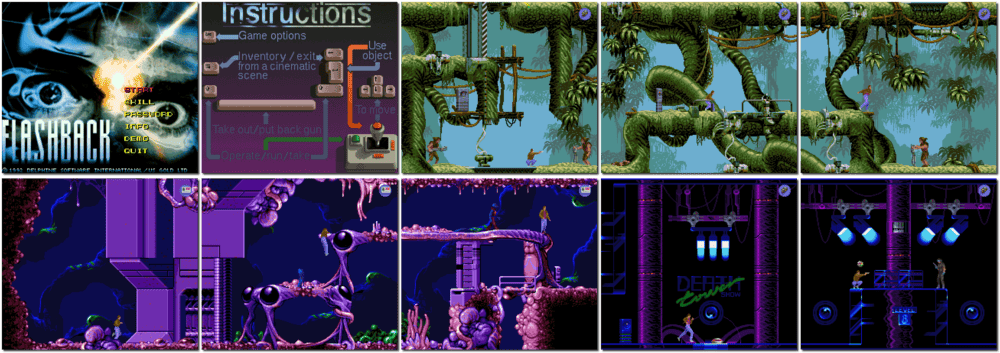

# Flashback

「**Flashback: The Quest for Identity**」

> ❝ You are Conrad B. Hart, Galaxis Bureau of Investigation Agent, stranded on a far-away planet after discovering an alien plot to overtake Earth. You must travel and find your way through four planets back to Earth and foil the aliens' sinister and deadly plans. ❞
>
> ❝ This game **is not abandonware 🚫** and is still for sale on [GOG 💰](https://www.gog.com/en/game/flashback). ❞
>

📌 ┃ **Year** ‣ 1993 ┃ **Genre** ‣ Action ┃ **Platform** ‣ DOS ┃ **License** ‣ Proprietary ┃ **Media** ‣ CD-ROM 

📦 ┃ **[DOSBox](https://www.dosbox.com/) 🟩** ┃ **[DOSBox Staging](https://dosbox-staging.github.io/) 🟩** ┃ **[DOSBox-X](https://dosbox-x.com/) 🟩** 

📎 ┃ **[Wikipedia](https://en.wikipedia.org/wiki/Flashback_(1992_video_game))** ┃ **[MobyGames](https://www.mobygames.com/game/555/flashback-the-quest-for-identity/)** ┃ **[MyAbandonware](https://www.myabandonware.com/game/flashback-the-quest-for-identity-1lr)** ┃ **[GOG 💰](https://www.gog.com/en/game/flashback)** 

## Installation Notes
- Use the default **drive** and **directory** for the installation location.
- Sound FX: **Sound Blaster**
- Music: **Ad-Lib / Sound Blaster**

---

