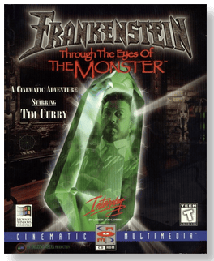
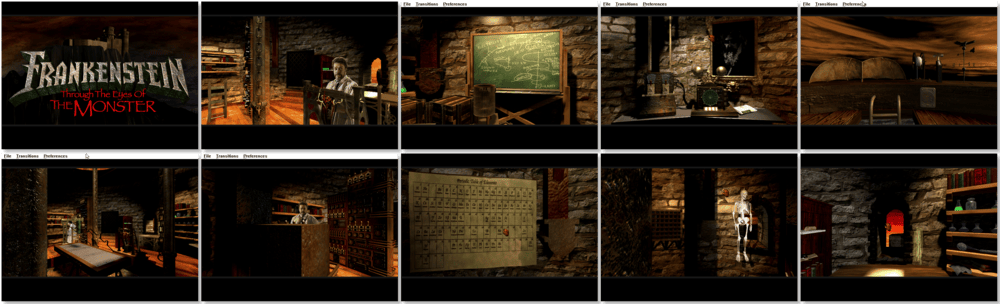

# Frankenstein: Through the Eyes of the Monster

> ❝ Between life and death, man and monster, lies the test of the human heart. With a crash of lightning, you are reborn to a world of haunted memories and science pushed beyond the bounds of nature. Your thoughts come slowly like distant echoes. The mystery of your existence pulls at your mind: An ancient castle of dark secrets and hidden terrors; A strange crystal glows with life itself. The burning memory of a child long thought dead and a discovery that crosses the boundaries between life and death. ❞
>

📌 ┃ **Year** ‣ 1995 ┃ **Genre** ‣ Adventure ┃ **Platform** ‣ Windows 3.1x ┃ **License** ‣ Abandonware ┃ **Media** ‣ CD-ROM 

📦 ┃ **[DOSBox](https://www.dosbox.com/) 🟩** ┃ **[DOSBox Staging](https://dosbox-staging.github.io/) 🟩** ┃ **[DOSBox-X](https://dosbox-x.com/) 🟩** 

📎 ┃ **[Wikipedia](https://en.wikipedia.org/wiki/Frankenstein:_Through_the_Eyes_of_the_Monster)** ┃ **[MobyGames](https://www.mobygames.com/game/3216/frankenstein-through-the-eyes-of-the-monster/)** ┃ **[MyAbandonware](https://www.myabandonware.com/game/frankenstein-through-the-eyes-of-the-monster-3k0)** 

## Installation Notes
- Use the default **drive** and **directory** for the installation location.
- Do not install *QuickTime*. Click **Exit** when prompted. Your Windows 3.1x has the most recent version.
- Exit Windows and DOSBox once the installation is complete (**Program Manager ‣ File ‣ Exit Windows**) and rerun the `Launch` script to start the program.

---

