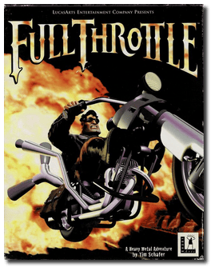
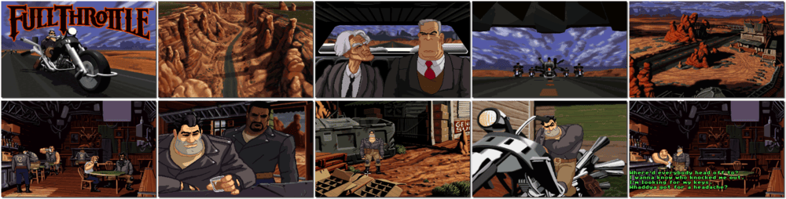

# Full Throttle

> ❝ You're Ben. You're on the road. You're indestructible. You'll do whatever it takes to clear your name from a bum murder rap - Like fighting ugly gangs with futuristic bikes and Neolithic weapons, running big rigs off the road at 100 mph, making people pay. But that is what happens when you live your life at Full Throttle. ❞
>
> ❝ This game **is not abandonware 🚫** and is still for sale on [GOG 💰](https://www.gog.com/en/game/full_throttle_remastered). ❞
>

📌 ┃ **Year** ‣ 1995 ┃ **Genre** ‣ Adventure ┃ **Platform** ‣ DOS ┃ **License** ‣ Proprietary ┃ **Media** ‣ CD-ROM 

📦 ┃ **[DOSBox](https://www.dosbox.com/) 🟩** ┃ **[DOSBox Staging](https://dosbox-staging.github.io/) 🟩** ┃ **[DOSBox-X](https://dosbox-x.com/) 🟩** 

📎 ┃ **[Wikipedia](https://en.wikipedia.org/wiki/Full_Throttle_(1995_video_game))** ┃ **[MobyGames](https://www.mobygames.com/game/940/full-throttle/)** ┃ **[MyAbandonware](https://www.myabandonware.com/game/full-throttle-33c)** ┃ **[GOG 💰](https://www.gog.com/en/game/full_throttle_remastered)** 

## Installation Notes
- Select **Install Full Throttle**.
- Use the default **drive** and **directory** for the installation location.
- Express or Custom Setup (E/C)? Press `E`. Follow auto-detection configuration and tests.
- Now you're ready to go! Press `ENTER`.
- Would you like to make a bootdisk? Press `ESC`.
- Select **Exit** to start the game.

---

