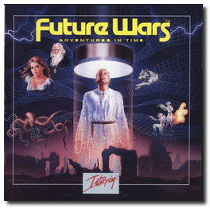
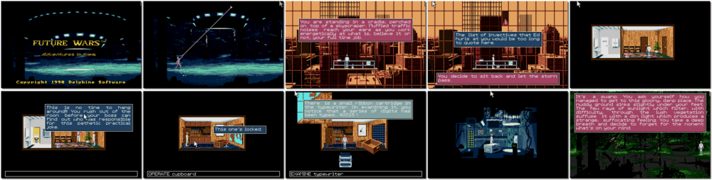

# Future Wars: Adventures in Time

「**Future Wars: Time Travellers**」「**Time Travelers: The Menace**」

> ❝ In the 43rd century, Earth is under attack by an alien race. The planet is well-protected by a formidable SDI defence that the aliens cannot penetrate. Until they hit on a plan, sabotage the defences before they are built by travelling back in time to plant delayed-action bombs at strategic places! Your adventure starts in the present day when, innocently attempting to avoid your boss at work, you stumble across a secret passage that transports you 'back in time' to the start of a quest that takes you into the Middle Ages, Prehistoric Times, and the distant future. ❞
>

📌 ┃ **Year** ‣ 1990 ┃ **Genre** ‣ Adventure ┃ **Platform** ‣ DOS ┃ **License** ‣ Abandonware ┃ **Category** ‣ 3rd-person • Graphic adventure • Puzzle elements • Sci-fi ┃ **Media** ‣ CD-ROM 

📦 ┃ **[DOSBox](https://www.dosbox.com/)** ‣ 0.74-3 🟨 (`F10` does not pop-up USER menu) ┃ **[DOSBox Staging](https://dosbox-staging.github.io/) 🟩** ┃ **[DOSBox-X](https://dosbox-x.com/) 🟩** 

📎 ┃ **[Wikipedia](https://en.wikipedia.org/wiki/Future_Wars)** ┃ **[MobyGames](https://www.mobygames.com/game/2205/future-wars-adventures-in-time/)** ┃ **[AbandonwareDOS](https://www.abandonwaredos.com/abandonware-game.php?abandonware=Future+Wars%3A+Adventures+in+Time&gid=308)** ┃ **[MyAbandonware](https://www.myabandonware.com/game/future-wars-adventures-in-time-wf)** 

## Installation Notes
- Skip **Hard disk installation** (the game is already installed).
- Graphic Adapter: **MCGA card.** (the VGA card causes flickering animation).
- Sound Device: **MT32, LAPC1, CM 32L and CM 64.**
- Cursor Moves: **Mouse.**
- *Save configuration* and *Return to DOS*.

