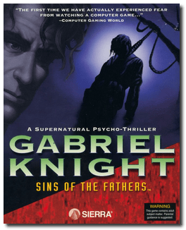
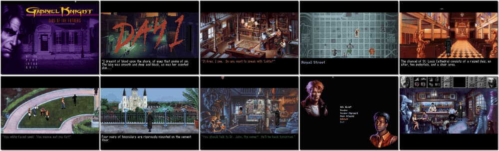

# Gabriel Knight: Sins of the Fathers

「**Gabriel Knight I**」

> ❝ He started out writing a book on voodoo. Now, he's fighting for his very soul. Gabriel Knight is the last in a long line of Shadow Hunters, those fated to fight the dark forces of the supernatural. Haunted by a centuries-old curse, terrifying nightmares torment him. Now, he must spend every waking moment scouring the side streets and back alleys of New Orleans for the key to his dark past. And when he sleeps - the nightmare begins. ❞
>
> ❝ This game **is not abandonware 🚫** and is still for sale on [GOG 💰](https://www.gog.com/en/game/gabriel_knight_sins_of_the_fathers) and [Steam 💰](https://store.steampowered.com/app/495700/Gabriel_Knight_Sins_of_the_Father/). ❞
>

📌 ┃ **Year** ‣ 1993 ┃ **Genre** ‣ Adventure ┃ **Platform** ‣ DOS ┃ **License** ‣ Proprietary ┃ **Media** ‣ CD-ROM ┃ **Patched** ‣ 1.0a 

📦 ┃ **[DOSBox](https://www.dosbox.com/) 🟩** ┃ **[DOSBox Staging](https://dosbox-staging.github.io/) 🟩** ┃ **[DOSBox-X](https://dosbox-x.com/) 🟩** 

📎 ┃ **[Wikipedia](https://en.wikipedia.org/wiki/Gabriel_Knight:_Sins_of_the_Fathers)** ┃ **[MobyGames](https://www.mobygames.com/game/116/gabriel-knight-sins-of-the-fathers/)** ┃ **[MyAbandonware](https://www.myabandonware.com/game/gabriel-knight-sins-of-the-fathers-22m)** ┃ **[Series](https://en.wikipedia.org/wiki/Gabriel_Knight)** ┃ **[GOG 💰](https://www.gog.com/en/game/gabriel_knight_sins_of_the_fathers)** ┃ **[Steam 💰](https://store.steampowered.com/app/495700/Gabriel_Knight_Sins_of_the_Father/)** 

## Installation Notes
- Use the default **drive** and **directory** for the installation location.
- Installation Choices:
  - Set Graphics to **VESA - High Resolution (640x480) with 256 Colors**.
  - Set Music to **Sound Blaster / AdLib Card (or compatibles)**.
  - Set Audio to **Sound Blaster**.
  - Select **Accept these choices and begin installation**.
  - Press `F` when prompted to perform **full installation**.
  - Press `Y` when prompted to **copy high resolution art**.

---

