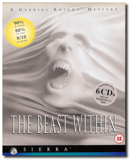
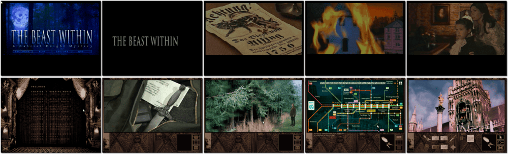

# Gabriel Knight 2: The Beast Within

「**The Beast Within: A Gabriel Knight Mystery**」「**GK2**」「**Gabriel Knight 2**」

> ❝ Now we find Schattenjäger, or shadow hunter, Gabriel and his assistant Grace deeply embroiled in a murder mystery that unravels half a world away. Play as both Gabriel and Grace as they are dispatched to Munich to solve a series of mutilation murders thought to be the work of werewolves. Gabriel confronts his demons while Grace traces a historical mystery, that of the strange demise of Mad King Ludwig II. The hunters become the hunted, and the only hope for deliverance lies in the most desperate schemes. ❞
>
> ❝ This game **is not abandonware 🚫** and is still for sale on [GOG 💰](https://gog.com/en/game/gabriel_knight_2_the_beast_within) and [Steam 💰](https://store.steampowered.com/app/496760/The_Beast_Within_A_Gabriel_Knight_Mystery/). ❞
>

📌 ┃ Year: **1995** ┃ Genre: **Adventure** ┃ Platform: **DOS** ┃ License: **Proprietary** ┃ Category: **3rd-person • Puzzle elements • Detective • Horror** ┃ Media: **CD-ROM** 

📦 ┃ **[DOSBox](https://www.dosbox.com/) 🟩** ┃ **[DOSBox Staging](https://dosbox-staging.github.io/) 🟩** ┃ **[DOSBox-X](https://dosbox-x.com/) 🟩** 

📎 ┃ **[Wikipedia](https://en.wikipedia.org/wiki/The_Beast_Within:_A_Gabriel_Knight_Mystery)** ┃ **[Wikipedia - Gabriel Knight Series](https://en.wikipedia.org/wiki/Gabriel_Knight)** ┃ **[MobyGames](https://www.mobygames.com/game/118/the-beast-within-a-gabriel-knight-mystery/)** ┃ **[AbandonwareDOS](https://www.abandonwaredos.com/abandonware-game.php?abandonware=Gabriel+Knight+2%3A+The+Beast+Within&gid=2279)** ┃ **[MyAbandonware](https://www.myabandonware.com/game/the-beast-within-a-gabriel-knight-mystery-3gu)** ┃ **[Gabriel Knight Fandom](https://gabrielknight.fandom.com/wiki/The_Beast_Within:_A_Gabriel_Knight_Mystery)** ┃ **[GOG 💰](https://gog.com/en/game/gabriel_knight_2_the_beast_within)** ┃ **[Steam 💰](https://store.steampowered.com/app/496760/The_Beast_Within_A_Gabriel_Knight_Mystery/)** 

## Installation Notes
- Use the default **drive** and **directory** for the installation location.
- Installation Choices:
  - Set Audio to **Sound Blaster**.
  - Select **Accept these choices and begin installation**.
  - Press `L` when prompted to perform **Larger installation**.

## Additional Notes
- Mounted CD-ROM images at launch:
  1. Gabriel Knight 2: The Beast Within Disc #1
  2. Gabriel Knight 2: The Beast Within Disc #2
  3. Gabriel Knight 2: The Beast Within Disc #3
  4. Gabriel Knight 2: The Beast Within Disc #4
  5. Gabriel Knight 2: The Beast Within Disc #5
  6. Gabriel Knight 2: The Beast Within Disc #6

### How to swap CD-ROM images?
- [DOSBox](https://www.dosbox.com/wiki/DOSBox_FAQ#Swapping_CD_images) — Hotkey: CTRL+F4
- [DOSBox Staging](https://github.com/dosbox-staging/dosbox-staging/blob/main/README) — Hotkey: CTRL+F4 (or CMD+F4 on macOS)
- [DOSBox-X](https://dosbox-x.com/wiki/Guide%3AManaging-image-files-in-DOSBox%E2%80%90X#_mounting_multiple_cd_or_dvd_images) — Hotkey: F11+CTRL+C (or F12+D on macOS). Menu: DOS > Swap CD drive.

