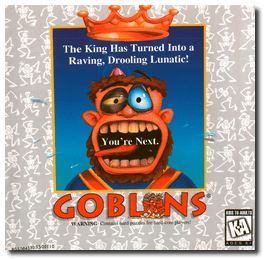
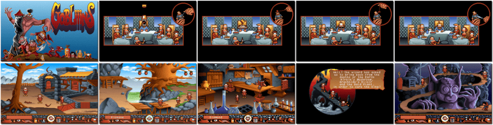

# Gobliiins

「**Gobliiins 1**」「**Goblins**」

> ❝ Can you help the Good King regain his sanity before you lose yours forever? Your mission is to track down the dark force abusing the Good King's voodoo doll. Find them, stop them, and usher in an era of peace and prosperity. Simple, huh? WRONG! Gobliiins is a warped and wonderful quest, filled with level after level of truly twisted object, inventory, and logic puzzles. You command Hooter, Dwayne, and BoBo, three eager imps with specific skills. Hooter casts spells. Dwayne can pick objects up and use them. BoBo has a mean right hook. Individually, they're no match for the dark force, but together... they're still no match... That's where you come in. ❞
>
> ❝ This game **is not abandonware 🚫** and **Gobliiins Pack** release is available on [GOG 💰](https://www.gog.com/en/game/gobliiins_pack). ❞
>

📌 ┃ **Year** ‣ 1991 ┃ **Genre** ‣ Puzzle ┃ **Platform** ‣ DOS ┃ **License** ‣ Proprietary ┃ **Category** ‣ 3rd-person • Fantasy ┃ **Media** ‣ CD-ROM 

📦 ┃ **[DOSBox](https://www.dosbox.com/) 🟩** ┃ **[DOSBox Staging](https://dosbox-staging.github.io/) 🟩** ┃ **[DOSBox-X](https://dosbox-x.com/) 🟩** 

📎 ┃ **[Wikipedia](https://en.wikipedia.org/wiki/Gobliiins#Gobliiins_(1991))** ┃ **[MobyGames](https://www.mobygames.com/game/1154/gobliiins/)** ┃ **[AbandonwareDOS](https://www.abandonwaredos.com/abandonware-game.php?abandonware=Gobliiins&gid=1545)** ┃ **[MyAbandonware](https://www.myabandonware.com/game/gobliiins-1f1)** ┃ **Gobliiins Pack** ‣ [GOG 💰](https://www.gog.com/en/game/gobliiins_pack) 

## Installation Notes
- Choose your language.
- What do you want to install? Press `F1` for **Game**.
- Use the default **drive** and **directory** for the installation location.
- Press `ENTER` to confirm the settings.

