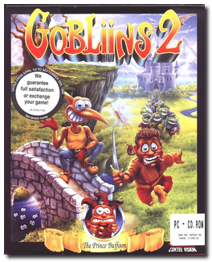
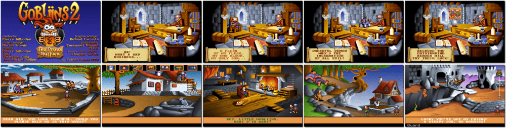

# Gobliins 2: The Prince Buffoon

「**Goblins 2**」

> ❝ Have you seen the three mischievous Gobliiins yet, those irresistibly funny and unpredictable characters? This time, there are two of them: Angus, the diplomat, and Winkle, the practical joker. They set off to find a kidnapped young Prince by the evil Demon King. This imposter is trying to make a jester out of him. How wicked! Never forget that to progress through this action-packed adventure littered with traps, Fingus and Winkle often have to work together to combine strength and deceit, resulting in a couple of cheeky characters. ❞
>
> ❝ This game **is not abandonware 🚫**. A **Gobliiins Pack** release is available on [GOG 💰](https://www.gog.com/en/game/gobliiins_pack). ❞
>

📌 ┃ **Year** ‣ 1992 ┃ **Genre** ‣ Puzzle ┃ **Platform** ‣ DOS ┃ **License** ‣ Proprietary ┃ **Media** ‣ CD-ROM 

📦 ┃ **[DOSBox](https://www.dosbox.com/) 🟩** ┃ **[DOSBox Staging](https://dosbox-staging.github.io/) 🟩** ┃ **[DOSBox-X](https://dosbox-x.com/) 🟩** 

📎 ┃ **[Wikipedia](https://en.wikipedia.org/wiki/Gobliiins#Gobliins_2:_The_Prince_Buffoon_(1992))** ┃ **[MobyGames](https://www.mobygames.com/game/2625/gobliins-2-the-prince-buffoon/)** ┃ **[MyAbandonware](https://www.myabandonware.com/game/gobliins-2-the-prince-buffoon-2jc)** ┃ **Gobliiins Pack** ‣ [GOG 💰](https://www.gog.com/en/game/gobliiins_pack) 

## Installation Notes
- Choose your language.
- What do you want to install? Press `F1` for **Game**.
- Use the default **drive** and **directory** for the installation location.
- Press `ENTER` to confirm the settings.

---

