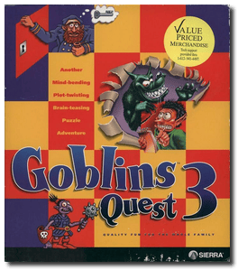
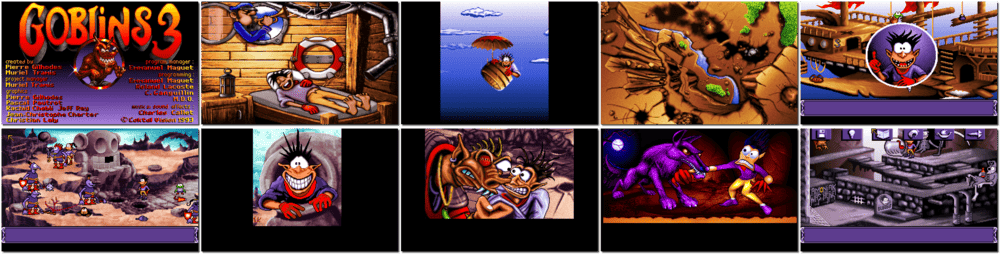

# Goblins Quest 3

「**Goblin's Quest 3**」「**Goblins 3**」

> ❝ There is a mysterious labyrinth harbouring great secrets that might fulfil the wishes of those who discover them. Two countries ruled by Queen Xina and King Bodd have been competing over the right to explore the maze. However, strange events started happening one after the other: the labyrinth guardian died, his daughter disappeared, and King Bodd fell under some curse. A goblin reporter named Blount gets caught amid these events as he attempts to interview the queen and the king. Blount also gets bitten by a werewolf, falls in love, and must find a way to deal with both predicaments. ❞
>
> ❝ This game **is not abandonware 🚫**. A **Gobliiins Pack** release is available on [GOG 💰](https://www.gog.com/en/game/gobliiins_pack). ❞
>

📌 ┃ **Year** ‣ 1993 ┃ **Genre** ‣ Puzzle ┃ **Platform** ‣ DOS ┃ **License** ‣ Proprietary ┃ **Category** ‣ 3rd-person • Fantasy ┃ **Media** ‣ CD-ROM 

📦 ┃ **[DOSBox](https://www.dosbox.com/) 🟩** ┃ **[DOSBox Staging](https://dosbox-staging.github.io/) 🟩** ┃ **[DOSBox-X](https://dosbox-x.com/) 🟩** 

📎 ┃ **[Wikipedia](https://en.wikipedia.org/wiki/Gobliiins#Goblins_Quest_3_(1993))** ┃ **[MobyGames](https://www.mobygames.com/game/2870/goblins-quest-3/)** ┃ **[AbandonwareDOS](https://www.abandonwaredos.com/abandonware-game.php?abandonware=Goblins+3&gid=2244)** ┃ **[MyAbandonware](https://www.myabandonware.com/game/goblins-quest-3-1zc)** ┃ **Gobliiins Pack** ‣ [GOG 💰](https://www.gog.com/en/game/gobliiins_pack) 

## Installation Notes
- Choose your language.
- Press `F1` to select **Complete installation 116.5 MB**.
- Use the default **drive** and **directory** for the installation location.
- Press `ENTER` to confirm the settings.

