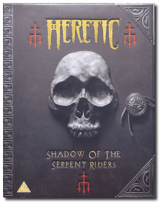
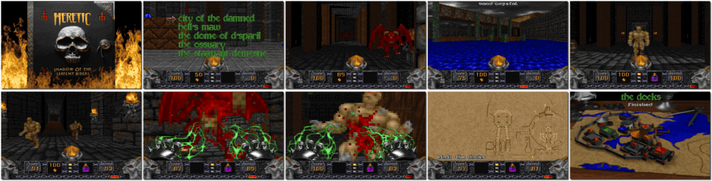

# Heretic: Shadow of the Serpent Riders

「**Heretic**」

> ❝ Evil grows darkest in the shadow. This chapter comes to its evil conclusion with Heretic: Shadow of the Serpent Riders. Undead creatures and bestial horrors have done the unthinkable - callously slaughtering your entire race. But the nightmare has just begun. Wielding ungodly weapons such as the Firemace or Hellstaff and casting spells from the tomes of power, you must seek your vengeance or die trying. ❞
>
> ❝ This game **is not abandonware 🚫** and is still for sale on [Steam 💰](https://store.steampowered.com/app/2390/Heretic_Shadow_of_the_Serpent_Riders/). A **Heretic + Hexen Collection** release is available on [GOG 💰](https://www.gog.com/game/heretic_hexen_collection). ❞
>

📌 ┃ **Year** ‣ 1996 ┃ **Genre** ‣ Action ┃ **Platform** ‣ DOS ┃ **License** ‣ Proprietary ┃ **Category** ‣ 1st-person • Shooter • Fantasy ┃ **Media** ‣ CD-ROM 

📦 ┃ **[DOSBox](https://www.dosbox.com/) 🟩** ┃ **[DOSBox Staging](https://dosbox-staging.github.io/) 🟩** ┃ **[DOSBox-X](https://dosbox-x.com/) 🟩** 

📎 ┃ **[Wikipedia](https://en.wikipedia.org/wiki/Heretic_(video_game))** ┃ **[MobyGames](https://www.mobygames.com/game/1929/heretic-shadow-of-the-serpent-riders/)** ┃ **[AbandonwareDOS](https://www.abandonwaredos.com/abandonware-game.php?abandonware=Heretic&gid=1251)** ┃ **[MyAbandonware](https://www.myabandonware.com/game/heretic-shadow-of-the-serpent-riders-dq4)** ┃ **[Steam 💰](https://store.steampowered.com/app/2390/Heretic_Shadow_of_the_Serpent_Riders/)** ┃ **Heretic + Hexen Collection** ‣ [GOG 💰](https://www.gog.com/game/heretic_hexen_collection) 

## Installation Notes
- Use the default **drive** and **directory** for the installation location.
- Controller Type: **Keyboard + Mouse**.
- Select Music Card: **Sound Blaster**.
- Select Port Address: **220**.
- Select Sound FX Device: **Sound Blaster**.
- Select Port Address: **220**.
- Select IRQ: **7**.
- Select DMA Channel: **1**.
- Number of Sound FX to Mix: **6**.
- **Save parameters and launch Heretic**.

