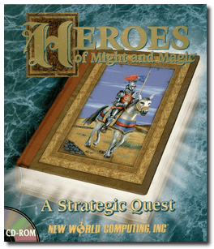
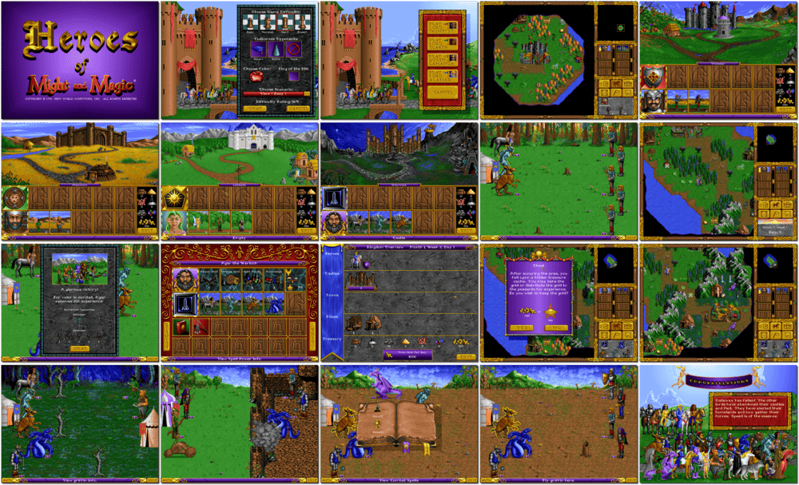

# Heroes of Might and Magic: A Strategic Quest

「**Heroes of Might and Magic I**」

> ❝ The realms of might and magic are expanding. You have discovered new lands. Rise to the challenge of conquering them. Beware, for many warlords have risen to test your leadership and tactics. You must carefully manage all the resources at your disposal or be defeated. Now is the time to recruit your heroes, gather your armies, and lead them to victory. ❞
>
> ❝ This game **is not abandonware 🚫** and is still for sale on [GOG 💰](https://www.gog.com/en/game/heroes_of_might_and_magic) and [Ubisoft 💰](https://store.ubisoft.com/us/heroes-of-might-and-magic/5928435d29e12307548b456a.html?lang=en_US). ❞
>

📌 ┃ **Year** ‣ 1995 ┃ **Genre** ‣ Strategy ┃ **Platform** ‣ DOS ┃ **License** ‣ Proprietary ┃ **Media** ‣ CD-ROM ┃ **Patched** ‣ 1.2 

📦 ┃ **[DOSBox](https://www.dosbox.com/) 🟩** ┃ **[DOSBox Staging](https://dosbox-staging.github.io/) 🟩** ┃ **[DOSBox-X](https://dosbox-x.com/) 🟩** 

📎 ┃ **[Wikipedia](https://en.wikipedia.org/wiki/Heroes_of_Might_and_Magic:_A_Strategic_Quest)** ┃ **[MobyGames](https://www.mobygames.com/game/668/heroes-of-might-and-magic/)** ┃ **[MyAbandonware](https://www.myabandonware.com/game/heroes-of-might-and-magic-2rr)** ┃ **[Series](https://en.wikipedia.org/wiki/Heroes_of_Might_and_Magic)** ┃ **[GOG 💰](https://www.gog.com/en/game/heroes_of_might_and_magic)** ┃ **[Ubisoft 💰](https://store.ubisoft.com/us/heroes-of-might-and-magic/5928435d29e12307548b456a.html?lang=en_US)** 

## Installation Notes
- Press `2` to *Change Sound Card*: **8. Sound Blaster 16/AWE32/Compatible**; **3. 16 Bit Music Stereo ( Highest Quality )**.
- Press `5` to *Install Heroes of Might and Magic*.
- Use the default **drive** and **directory** for the installation location.

---

