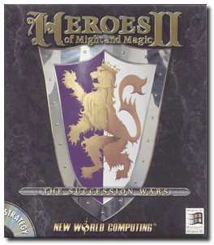
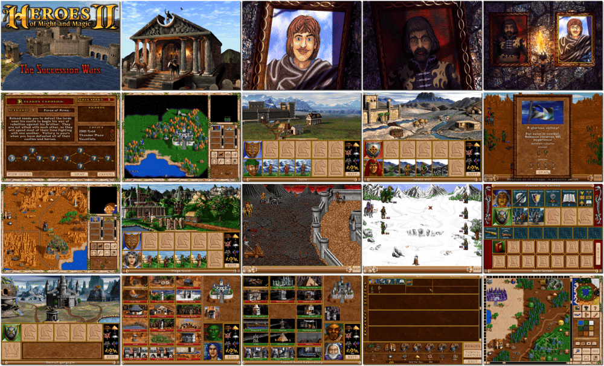

# Heroes of Might and Magic II: The Succession Wars

「**Heroes of Might and Magic II**」「**Heroes 2**」

> ❝ After years of peace under the benevolent rule of Lord Ironfist, the lands of Enroth again fall into turmoil. Twin sons, one good, one evil, fight for the coveted throne. Choose which side to support in the coming wars. Will you back the villainous usurper and lead his evil hordes, or be loyal to the righteous prince and lead the armies of light? The choice is yours, the challenge is immense, and the consequence of failure is death! ❞
>
> ❝ This game **is not abandonware 🚫**. This version is the original **The Succession Wars** release for DOS. The expansion add-on, **The Price of Loyalty**, is available with the **Gold Edition** release on [GOG 💰](https://www.gog.com/en/game/heroes_of_might_and_magic_2_gold_edition) and [Ubisoft 💰](https://store.ubisoft.com/us/heroes-of-might-and-magic-2--gold/5902fdf9ef3aa527608b4567.html?lang=en_US). ❞
>

📌 ┃ **Year** ‣ 1996 ┃ **Genre** ‣ Strategy ┃ **Platform** ‣ DOS ┃ **License** ‣ Proprietary ┃ **Media** ‣ CD-ROM ┃ **Patched** ‣ 1.2 

📦 ┃ **[DOSBox](https://www.dosbox.com/) 🟩** ┃ **[DOSBox Staging](https://dosbox-staging.github.io/) 🟩** ┃ **[DOSBox-X](https://dosbox-x.com/) 🟩** 

📎 ┃ **[Wikipedia](https://en.wikipedia.org/wiki/Heroes_of_Might_and_Magic_II)** ┃ **[MobyGames](https://www.mobygames.com/game/1513/heroes-of-might-and-magic-ii-the-succession-wars/)** ┃ **[MyAbandonware](https://www.myabandonware.com/game/heroes-of-might-and-magic-ii-the-succession-wars-3l0)** ┃ **[Fandom](https://mightandmagic.fandom.com/wiki/Heroes_of_Might_and_Magic_II:_The_Succession_Wars)** ┃ **[Series](https://en.wikipedia.org/wiki/Heroes_of_Might_and_Magic)** ┃ **Gold Edition** ‣ [GOG 💰](https://www.gog.com/en/game/heroes_of_might_and_magic_2_gold_edition) ┃ **Gold Edition** ‣ [Ubisoft 💰](https://store.ubisoft.com/us/heroes-of-might-and-magic-2--gold/5902fdf9ef3aa527608b4567.html?lang=en_US) 

## Installation Notes
- Press `2` to *Install Heroes of Might and Magic II*.
- Use the default **drive** and **directory** for the installation location.
- Press `2` to *Change Sound Card Configuration*.
- Sound Configuration Options:
  - Select and configure MIDI music driver: **Creative Labs Sound Blaster(TM) 16** (*Attempt to configure sound driver automatically*).
  - Select and configure digital audio driver: **Creative Labs Sound Blaster 16 or AWE32** (*Attempt to configure sound driver automatically*).
- Press `3` to *Save changes*.

---

