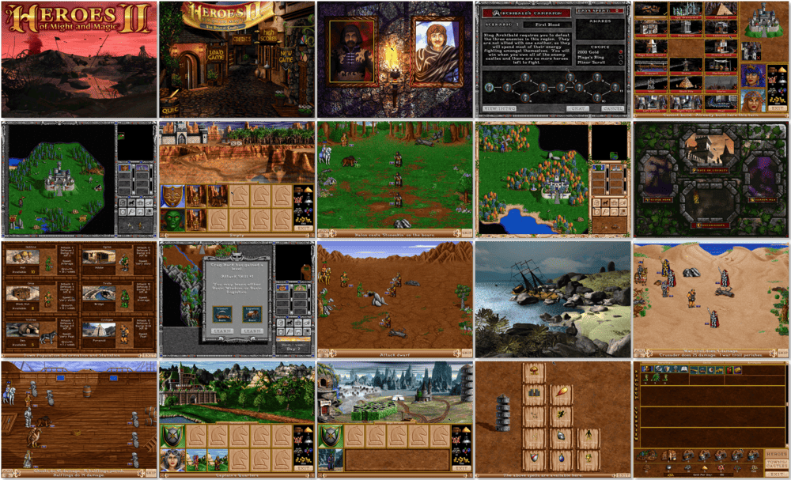

# Heroes of Might and Magic II: Gold

「**Heroes of Might and Magic II: The Succession Wars** (Base)」「**Heroes of Might and Magic II: The Price of Loyalty** (Add-on)」「**Heroes of Might and Magic II**」「**Heroes 2**」

> ❝ After years of peace under the benevolent rule of Lord Ironfist, the lands of Enroth again fall into turmoil. Twin sons, one good, one evil, fight for the coveted throne. Choose which side to support in the coming wars. Will you back the villainous usurper and lead his evil hordes, or be loyal to the righteous prince and lead the armies of light? The choice is yours, the challenge is immense, and the consequence of failure is death! ❞
>
> ❝ This game **is not abandonware 🚫** and is still for sale on [GOG 💰](https://www.gog.com/en/game/heroes_of_might_and_magic_2_gold_edition) and [Ubisoft 💰](https://store.ubisoft.com/us/heroes-of-might-and-magic-2--gold/5902fdf9ef3aa527608b4567.html?lang=en_US) ❞
>

📌 ┃ **Year (Heroes of Might and Magic II: The Succession Wars)** ‣ 1996 ┃ **Year (Heroes of Might and Magic II: The Price of Loyalty)** ‣ 1997 ┃ **Year (Heroes of Might and Magic II: Gold)** ‣ 1998 ┃ **Genre** ‣ Strategy ┃ **Platform** ‣ Windows 9x ┃ **License** ‣ Proprietary ┃ **Media** ‣ CD-ROM ┃ **Add-on** 

📦 ┃ **[DOSBox](https://www.dosbox.com/) 🟩** ┃ **[DOSBox Staging](https://dosbox-staging.github.io/) 🟩** ┃ **[DOSBox-X](https://dosbox-x.com/) 🟩** 

📎 ┃ **Heroes of Might and Magic II: The Succession Wars** ‣ [Wikipedia](https://en.wikipedia.org/wiki/Heroes_of_Might_and_Magic_II) • [MobyGames](https://www.mobygames.com/game/1513/heroes-of-might-and-magic-ii-the-succession-wars/) • [MyAbandonware](https://www.myabandonware.com/game/heroes-of-might-and-magic-ii-the-succession-wars-3l0) ┃ **Heroes of Might and Magic II: The Price of Loyalty** ‣ [MobyGames](https://www.mobygames.com/game/1514/heroes-of-might-and-magic-ii-the-price-of-loyalty/) ┃ **Heroes of Might and Magic II: Gold** ‣ [MobyGames](https://www.mobygames.com/game/32082/heroes-of-might-and-magic-ii-gold/) • [MyAbandonware](https://www.myabandonware.com/game/heroes-of-might-and-magic-ii-gold-crt) ┃ **[Series](https://en.wikipedia.org/wiki/Heroes_of_Might_and_Magic)** ┃ **Gold Edition** ‣ [GOG 💰](https://www.gog.com/en/game/heroes_of_might_and_magic_2_gold_edition) ┃ **Gold Edition** ‣ [Ubisoft 💰](https://store.ubisoft.com/us/heroes-of-might-and-magic-2--gold/5902fdf9ef3aa527608b4567.html?lang=en_US) 

## Installation Notes
- Open *My Computer* and double-click on the `D:` CD-ROM drive to start the installation.
- Use the default **drive** and **directory** for the installation location.

---

