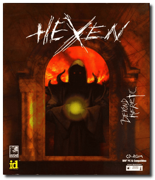
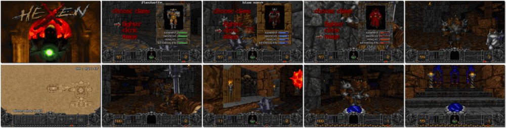

# Hexen: Beyond Heretic

「**Hexen**」「**Heretic 2**」

> ❝ While you were battling the evil forces of D'Sparil, the other Serpent Riders were busy sowing the seeds of destruction in alternate dimensions. One such dimension is the decaying world where Hexen takes place. A world littered with the mangled corpses of nonbelievers and inhabited by the undead followers that executed them. Only three humans: a warrior, a mage, and a cleric - have escaped the leaders' vicious spell. Three brave souls have the sword to crush the evil regime that threatens to destroy the world forever. ❞
>
> ❝ This game **is not abandonware 🚫** and is still for sale on [GOG 💰](https://www.gog.com/en/game/hexen_beyond_heretic) and [Steam 💰](https://store.steampowered.com/app/2360/Hexen_Beyond_Heretic/). ❞
>

📌 ┃ **Year** ‣ 1995 ┃ **Genre** ‣ Action ┃ **Platform** ‣ DOS ┃ **License** ‣ Proprietary ┃ **Media** ‣ CD-ROM 

📦 ┃ **[DOSBox](https://www.dosbox.com/) 🟩** ┃ **[DOSBox Staging](https://dosbox-staging.github.io/) 🟩** ┃ **[DOSBox-X](https://dosbox-x.com/) 🟩** 

📎 ┃ **[Wikipedia](https://en.wikipedia.org/wiki/Hexen:_Beyond_Heretic)** ┃ **[MobyGames](https://www.mobygames.com/game/1938/hexen-beyond-heretic/)** ┃ **[MyAbandonware](https://www.myabandonware.com/game/hexen-beyond-heretic-2bd)** ┃ **[GOG 💰](https://www.gog.com/en/game/hexen_beyond_heretic)** ┃ **[Steam 💰](https://store.steampowered.com/app/2360/Hexen_Beyond_Heretic/)** 

## Installation Notes
- Use the default **drive** and **directory** for the installation location.
- Exit the README file by pressing `ALT` + `X` (macOS: `fn + option` + `X`).
- Controller Type: **Keyboard + Mouse**.
- Select Music Card: **Sound Blaster**.
- Select Port Address: **220**.
- Select Sound FX Device: **Sound Blaster**.
- Select Port Address: **220**.
- Select IRQ: **7**.
- Select DMA Channel: **1**.
- Number of Sound FX to Mix: **6**.
- **Save parameters and launch Hexen**.

---

