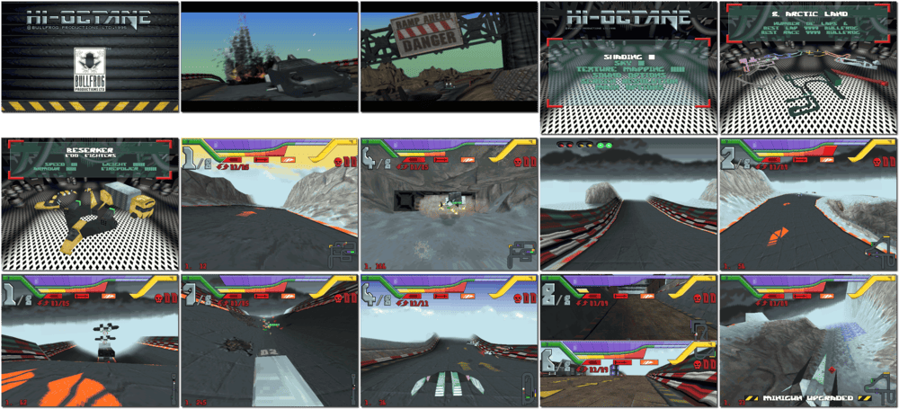

# Hi-Octane

「**Hi-Octane: The Track Fights Back**」

> ❝ Racers drive to their death on the bleak streets of the 21st century. Hi-Octane puts you behind the wheel of an armour-plated Hov-Car capable of 400+mph. Race through city streets, open wastelands or deserts faster than a Ferrari and with accessories you'd never find on a Volvo (like a missile launcher and chain gun). If anyone gets in your way, remember your highway code: Mirror. Signal. Fire! ❞
>

📌 ┃ **Year** ‣ 1995 ┃ **Genre** ‣ Racing ┃ **Platform** ‣ DOS ┃ **License** ‣ Abandonware ┃ **Media** ‣ CD-ROM ┃ **Patched** ‣ New tracks and new game modes ┃ **No Manual** 

📦 ┃ **[DOSBox](https://www.dosbox.com/) 🟩** ┃ **[DOSBox Staging](https://dosbox-staging.github.io/) 🟩** ┃ **[DOSBox-X](https://dosbox-x.com/) 🟩** 

📎 ┃ **[Wikipedia](https://en.wikipedia.org/wiki/Hi-Octane)** ┃ **[MobyGames](https://www.mobygames.com/game/2208/hi-octane/)** ┃ **[MyAbandonware](https://www.myabandonware.com/game/hi-octane-29w)** 

## Installation Notes
- When prompted for the name of the CD-ROM drive, press `D`.
- When prompted to install the introduction, press `Y`.

## Additional Notes
- For high-resolution graphics, go to *Options ‣ Detail Options ‣ Screen Resolution*, and select **640 x 480 256 Colours**.

---

