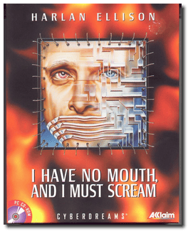

# I Have No Mouth, and I Must Scream

「**Harlan Ellison: I Have No Mouth, and I Must Scream**」

> ❝ Assume the roles of five different characters, each in a unique environment. Challenging dilemma dealing with powerfully charged emotional issues. Provocative psychological and adult-oriented themes. Based on Harlan Ellison's short story "I Have No Mouth, and I Must Scream", one of the ten most reprinted stories in the English language. Buried deep within the centre of the earth, trapped in the bowels of an insane computer for the past hundred and nine years: Gorrister the suicidal loner, Benny the mutilated brute, Ellen the hysterical phobic, Nimdok the secretive sadist, and Ted the cynical paranoid. ❞
>
> ❝ This game **is not abandonware 🚫** and is still for sale on [GOG 💰](https://www.gog.com/en/game/i_have_no_mouth_and_i_must_scream) and [Steam 💰](https://store.steampowered.com/app/245390/I_Have_No_Mouth_and_I_Must_Scream/). ❞
>

📌 ┃ Year: **1995** ┃ Genre: **Adventure** ┃ Platform: **DOS** ┃ License: **Proprietary** ┃ Category: **3rd-person • Real-time • Graphic adventure • Cyberpunk • Post-apocalyptic • Horror** ┃ Media: **CD-ROM** 

📦 ┃ **[DOSBox](https://www.dosbox.com/) 🟩** ┃ **[DOSBox Staging](https://dosbox-staging.github.io/) 🟩** ┃ **[DOSBox-X](https://dosbox-x.com/) 🟩** 

📎 ┃ **[Wikipedia](https://en.wikipedia.org/wiki/I_Have_No_Mouth,_and_I_Must_Scream_(video_game))** ┃ **[MobyGames](https://www.mobygames.com/game/617/harlan-ellison-i-have-no-mouth-and-i-must-scream/)** ┃ **[AbandonwareDOS](https://www.abandonwaredos.com/abandonware-game.php?abandonware=I+have+no+Mouth+and+I+Must+Scream&gid=1704)** ┃ **[MyAbandonware](https://www.myabandonware.com/game/harlan-ellison-i-have-no-mouth-and-i-must-scream-2sv)** ┃ **[GOG 💰](https://www.gog.com/en/game/i_have_no_mouth_and_i_must_scream)** ┃ **[Steam 💰](https://store.steampowered.com/app/245390/I_Have_No_Mouth_and_I_Must_Scream/)** 

## Installation Notes
- **Install the Game**.
  - Use the default **drive** and **directory** for the installation location.
  - Select **3) Full Install (115 megabytes)**.
- Sound Configuration Options:
  - Select and configure MIDI music driver: **Creative Labs Sound Blaster(TM) 16** (*Attempt to configure sound driver automatically*).
  - Select and configure digital audio driver: **Creative Labs Sound Blaster 16 or AWE32** (*Attempt to configure sound driver automatically*).

