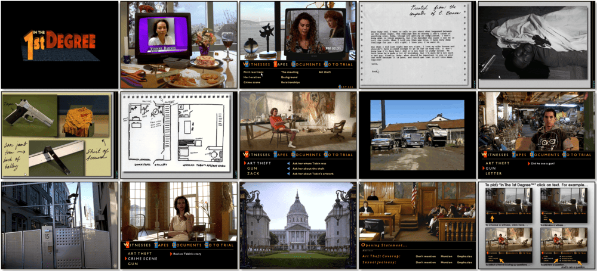

# In the 1st Degree

> ❝ Someone is dead. Someone is lying. Can you prove Murder One? Some artists die for their art. James Tobin killed, or did he? As a D.A. in San Francisco, you must prove that he did. It has become the most sensational murder case to hit the Bay Area in years. Who will lead you to the truth? The passionate girlfriend of the accused? The socially connected wife of the victim? Perhaps his bitter apprentice? Every reluctant witness and shred of evidence may paint a homicidal portrait as chilling and surreal as one of Tobin's paintings. And as if that were not enough, everyone will be watching you on this one, especially the media. ❞
>

📌 ┃ **Year** ‣ 1995 ┃ **Genre** ‣ Adventure ┃ **Platform** ‣ Windows 3.1x ┃ **License** ‣ Abandonware ┃ **Media** ‣ CD-ROM ┃ **No Manual** 

📦 ┃ **[DOSBox](https://www.dosbox.com/) 🟩** ┃ **[DOSBox Staging](https://dosbox-staging.github.io/) 🟩** ┃ **[DOSBox-X](https://dosbox-x.com/) 🟩** 

📎 ┃ **[Wikipedia](https://en.wikipedia.org/wiki/In_the_1st_Degree)** ┃ **[MobyGames](https://www.mobygames.com/game/2035/in-the-1st-degree/)** ┃ **[MyAbandonware](https://www.myabandonware.com/game/in-the-1st-degree-3lc)** 

## Installation Notes
- Click **Continue** to install *In the 1st Degree*.
- Use the default **drive** and **directory** for the installation location.
- Confirm the next default settings.
- Select **SB16 MIDI Out** for the MIDI Driver, pick either **Song 1** or **Song 2** according to your preference, then click **OK**.
- Exit Windows and DOSBox once the installation is complete (**Program Manager > File > Exit Windows**) and rerun the `Launch` script to start the program.

## Additional Notes
- Mounted CD-ROM images at launch:
  1. In the 1st Degree Disc #1
  2. In the 1st Degree Disc #2

### How to swap CD-ROM images?
- [DOSBox](https://www.dosbox.com/wiki/DOSBox_FAQ#Swapping_CD_images) — Hotkey: CTRL+F4
- [DOSBox Staging](https://github.com/dosbox-staging/dosbox-staging/blob/main/README) — Hotkey: CTRL+F4 (or CMD+F4 on macOS)
- [DOSBox-X](https://dosbox-x.com/wiki/Guide%3AManaging-image-files-in-DOSBox%E2%80%90X#_mounting_multiple_cd_or_dvd_images) — Hotkey: F11+CTRL+C (or F12+D on macOS). Menu: DOS > Swap CD drive.

---

