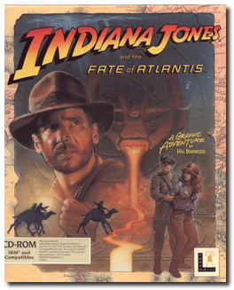
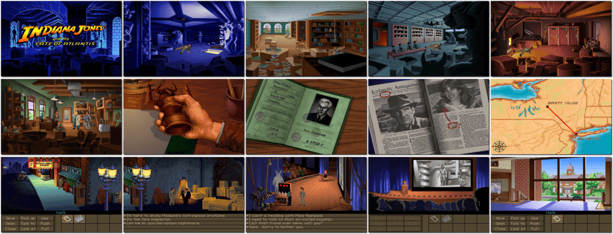

# Indiana Jones and the Fate of Atlantis

「**Indy IV**」

> ❝ Plato knew about Atlantis. In a lost dialogue, he wrote about the famed city and orichalcum, the mysterious element that powered the Atlanteans' stunning machinery. The Nazis know about Atlantis. They tracked down the lost dialogue and realized orichalcum would yield them the ultimate weapon of the age. Sophia knows about Atlantis. She unearthed a mysterious necklace and beads of orichalcum during an Icelandic archeological dig with Indy. Their magical properties made her a psychic. Everyone knows except Indy, and he has got to learn fast. The Nazis are one step ahead of him - from Iceland to North Africa and the Azores to Atlantis. ❞
>
> ❝ This game **is not abandonware 🚫** and is still for sale on [GOG 💰](https://www.gog.com/en/game/indiana_jones_and_the_fate_of_atlantis) and [Steam 💰](https://store.steampowered.com/app/6010/Indiana_Jones_and_the_Fate_of_Atlantis/). ❞
>

📌 ┃ **Year** ‣ 1992 ┃ **Genre** ‣ Adventure ┃ **Platform** ‣ DOS ┃ **License** ‣ Proprietary ┃ **Media** ‣ CD-ROM 

📦 ┃ **[DOSBox](https://www.dosbox.com/) 🟩** ┃ **[DOSBox Staging](https://dosbox-staging.github.io/) 🟩** ┃ **[DOSBox-X](https://dosbox-x.com/) 🟩** 

📎 ┃ **[Wikipedia](https://en.wikipedia.org/wiki/Indiana_Jones_and_the_Fate_of_Atlantis)** ┃ **[MobyGames](https://www.mobygames.com/game/316/indiana-jones-and-the-fate-of-atlantis/)** ┃ **[MyAbandonware](https://www.myabandonware.com/game/indiana-jones-and-the-fate-of-atlantis-1to)** ┃ **[Series](https://en.wikipedia.org/wiki/Indiana_Jones#Video_games)** ┃ **[GOG 💰](https://www.gog.com/en/game/indiana_jones_and_the_fate_of_atlantis)** ┃ **[Steam 💰](https://store.steampowered.com/app/6010/Indiana_Jones_and_the_Fate_of_Atlantis/)** 

## Installation Notes
- Setup Utility:
  - Music: **SoundBlaster & Compatibles / AdLib**.
  - Voice: **SoundBlaster & Compatibles**; Port: **220**; IRQ: **7**; Buffer: **8**.
  - Control: **Mouse + keyboard**.
  - Press `ESC` to Exit Setup and press `Y` to Save Settings.

---

