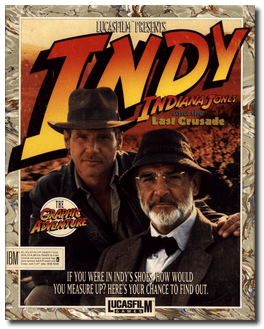
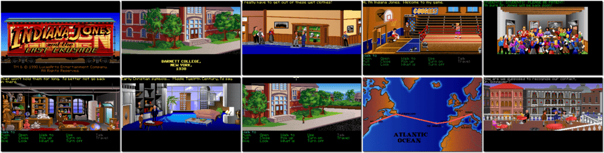

# Indiana Jones and the Last Crusade: The Graphic Adventure

「**Indy 3**」

> ❝ Europe, 1938. The Lost Ark was just a warm-up! Now Adolph Hitler is after the most powerful talisman of all - the Holy Grail. A few brave men stand in his way. Fortunately, one of them is Indiana Jones, and he has his dad with him. The bad guys are in your face - mercenaries, traitors, and spies. Not to mention everything the Luftwaffe can throw at you. Can you handle the heat? If you can, you might earn a higher I.Q. (Indy Quotient) then the man with the whip and the hat. ❞
>
> ❝ This game **is not abandonware 🚫** and is still for sale on [GOG 💰](https://gog.com/en/game/indiana_jones_and_the_last_crusade) and [Steam 💰](https://store.steampowered.com/app/32310/Indiana_Jones_and_the_Last_Crusade/). ❞
>

📌 ┃ Year: **1989** ┃ Genre: **Adventure** ┃ Platform: **DOS** ┃ License: **Proprietary** ┃ Category: **3rd-person • Graphic adventure • Puzzle elements • Interwar** ┃ Media: **Floppy Disk** 

📦 ┃ **[DOSBox](https://www.dosbox.com/) 🟩** ┃ **[DOSBox Staging](https://dosbox-staging.github.io/) 🟩** ┃ **[DOSBox-X](https://dosbox-x.com/) 🟩** 

📎 ┃ **[Wikipedia](https://en.wikipedia.org/wiki/Indiana_Jones_and_the_Last_Crusade:_The_Graphic_Adventure)** ┃ **[Wikipedia - Indiana Jones Series](https://en.wikipedia.org/wiki/Indiana_Jones#Video_games)** ┃ **[MobyGames](https://www.mobygames.com/game/534/indiana-jones-and-the-last-crusade-the-graphic-adventure/)** ┃ **[AbandonwareDOS](https://www.abandonwaredos.com/abandonware-game.php?abandonware=Indiana+Jones+and+the+Last+Crusade&gid=1295)** ┃ **[MyAbandonware](https://www.myabandonware.com/game/indiana-jones-and-the-last-crusade-the-graphic-adventure-1ba)** ┃ Manual: **[Games Database](https://www.gamesdatabase.org/game/microsoft-dos/indiana-jones-and-the-last-crusade)** ┃ **[GOG 💰](https://gog.com/en/game/indiana_jones_and_the_last_crusade)** ┃ **[Steam 💰](https://store.steampowered.com/app/32310/Indiana_Jones_and_the_Last_Crusade/)** 

## Installation Notes
- Hard drive on which to install program: **C:** and press `ENTER`.
- Floppy drive to read installation disks: **C:** and press `ENTER`.

