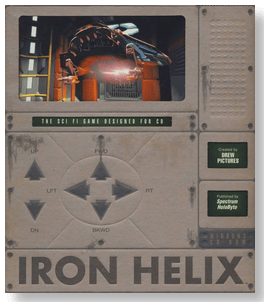
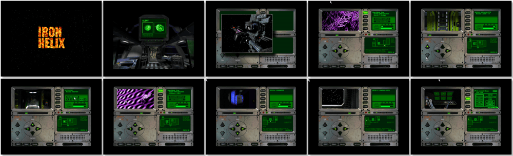

# Iron Helix

「**Iron Helix: A deadly war game gone awry...**」

> ❝ Iron Helix is a science fiction thriller that immerses you in a fast-paced virtual reality filled with danger and intrigue. Control a robot probe whose mission is to stop a renegade starship on an automated course of destruction. Prevent intergalactic war and the spread of a deadly virus by destroying the doomsday weapon - code name Iron Helix. Navigate through dozens of condors and rooms. Search for ways to stop the looming annihilation while eluding the ship's deadly defender robot. ❞
>

📌 ┃ **Year** ‣ 1993 ┃ **Genre** ‣ Action • Strategy ┃ **Platform** ‣ Windows 3.1x ┃ **License** ‣ Abandonware ┃ **Media** ‣ CD-ROM 

📦 ┃ **[DOSBox](https://www.dosbox.com/) 🟩** ┃ **[DOSBox Staging](https://dosbox-staging.github.io/) 🟩** ┃ **[DOSBox-X](https://dosbox-x.com/) 🟩** 

📎 ┃ **[Wikipedia](https://en.wikipedia.org/wiki/Iron_Helix)** ┃ **[MobyGames](https://www.mobygames.com/game/679/iron-helix/)** ┃ **[MyAbandonware](https://www.myabandonware.com/game/iron-helix-3lg)** 

## Installation Notes
- Use the default **drive** and **directory** for the installation location.
- Exit Windows and DOSBox once the installation is complete (**Program Manager ‣ File ‣ Exit Windows**) and rerun the `Launch` script to start the program.

---

