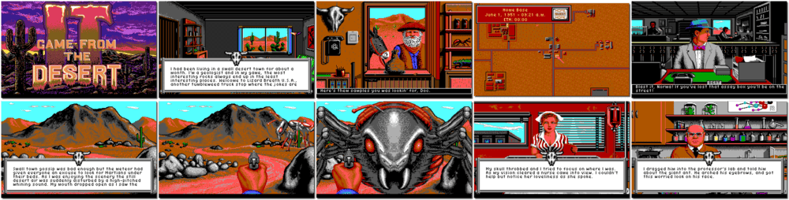

# It Came from the Desert

> ❝ A crawling terror whose towering fury no one can escape. A new dimension in terror that will have you screaming for mercy. Ants, twenty feet tall, go marching one by one, using your hometown as a human picnic basket! Panic grips the city as these monster-sized mutations strike terror all over again. Witness science fiction becomes fact as the unimaginable becomes real and the impossible becomes true! You will marvel as the screen explodes with action so real you can feel the desert wind chap your parched lips. Sound effects are so eerie you can hear the distant marching of giant harvester ants on the prowl! ❞
>

📌 ┃ **Year** ‣ 1990 ┃ **Genre** ‣ Action • Adventure ┃ **Platform** ‣ DOS ┃ **License** ‣ Freeware ┃ **Category** ‣ 1st-person • Top-down • Sci-fi • Detective ┃ **Media** ‣ CD-ROM 

📦 ┃ **[DOSBox](https://www.dosbox.com/) 🟩** ┃ **[DOSBox Staging](https://dosbox-staging.github.io/) 🟩** ┃ **[DOSBox-X](https://dosbox-x.com/) 🟩** 

📎 ┃ **[Wikipedia](https://en.wikipedia.org/wiki/It_Came_from_the_Desert)** ┃ **[MobyGames](https://www.mobygames.com/game/610/it-came-from-the-desert/)** ┃ **[AbandonwareDOS](https://www.abandonwaredos.com/abandonware-game.php?abandonware=It+Came+from+the+Desert&gid=2310)** ┃ **[MyAbandonware](https://www.myabandonware.com/game/it-came-from-the-desert-x4)** ┃ **Game Manual** ‣ [OldGames.sk](https://www.oldgames.sk/en/game/it-came-from-the-desert/) 

## Installation Notes
- Full function video modes: **VGA 16 color (PS/2 above model 30)**.
- Joystick selection: **Keyboard only**.
- Music: **Sound Blaster**.
- Sound Effects: **Sound Blaster**.
- Acknowledgment click: **Click noise on**.
- Installation: **Save selections to hard disc then run game**.

