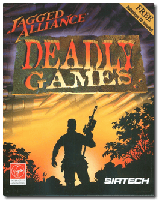
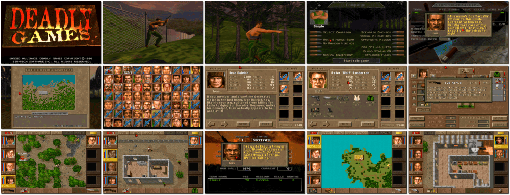

# Jagged Alliance: Deadly Games

> ❝ The enemy is on the run. One more mortar shell should take them out. Still, your mission is to blow up the bridge by sundown, and Postie is starting to talk to himself again. Maybe you shouldn't let him keep that dynamite. Lock and load: it's time for Deadly Games. From the makers of Jagged Alliance, 1995's Game of the Year (Power Play magazine), comes the multiplayer strategy game with more new features than you can shake a grenade launcher at. ❞
>
> ❝ This game **is not abandonware 🚫** and is still for sale on [GOG 💰](https://www.gog.com/en/game/jagged_alliance_deadly_games), [Steam 💰](https://store.steampowered.com/app/283270/Jagged_Alliance_1_Gold_Edition/) (**Gold Edition** includes Deadly Games), and [Zoom 💰](https://www.zoom-platform.com/product/jagged-alliance-deadly-games). ❞
>

📌 ┃ **Year** ‣ 1996 ┃ **Genre** ‣ Role-playing • Strategy ┃ **Platform** ‣ DOS ┃ **License** ‣ Proprietary ┃ **Category** ‣ Top-down • Turn-based • Tactical RPG • Contemporary ┃ **Media** ‣ CD-ROM ┃ **Patched • Extra Command** 

📦 ┃ **[DOSBox](https://www.dosbox.com/) 🟩** ┃ **[DOSBox Staging](https://dosbox-staging.github.io/) 🟩** ┃ **[DOSBox-X](https://dosbox-x.com/) 🟩** 

📎 ┃ **[Wikipedia](https://en.wikipedia.org/wiki/Jagged_Alliance:_Deadly_Games)** ┃ **[MobyGames](https://www.mobygames.com/game/2457/jagged-alliance-deadly-games/)** ┃ **[AbandonwareDOS](https://www.abandonwaredos.com/abandonware-game.php?abandonware=Jagged+Alliance%3A+Deadly+Games&gid=2165)** ┃ **[MyAbandonware](https://www.myabandonware.com/game/jagged-alliance-deadly-games-cqd)** ┃ **[Fandom](https://jaggedalliance.fandom.com/wiki/Jagged_Alliance:_Deadly_Games)** ┃ **[Series](https://en.wikipedia.org/wiki/Jagged_Alliance_(series))** ┃ **Patch** ‣ [Soggi.org](https://soggi.org/misc/game-patches.htm) ┃ **[GOG 💰](https://www.gog.com/en/game/jagged_alliance_deadly_games)** ┃ **Gold Edition** ‣ [Steam 💰](https://store.steampowered.com/app/283270/Jagged_Alliance_1_Gold_Edition/) ┃ **[Zoom 💰](https://www.zoom-platform.com/product/jagged-alliance-deadly-games)** 

## Host Requirements
- The game patch may fail to download. Download the patch file manually from [Soggi.org](https://soggi.org/misc/game-patches.htm) (search for *"Jagged Alliance: Deadly Games"*), place it in the `Assets` directory, and rename it to `patch.7z`.
- The game patch file is a [7-zip](https://www.7-zip.org/) archive. `7z` binary must be available and installed to apply the patch.

## Installation Notes
- Select **Install game files**.
- Select **Optimized Installation Gain extra speed (51MB)**.
- Use the default **drive** and **directory** for the installation location.
- Press `ESC` to bypass electronic registration.
- Sound Card Setup Program:
  - Select Card for Digital Sound: **Sound Blaster 16/AWE-32**, Auto-Detect Card: **Yes**.
  - Select Card for Music: **Sound Blaster Pro/16**, Auto-Detect Card: **Yes**.
  - Turn Subtitle Text On/Off: **Yes**.
  - **Save Settings** and **Exit to DOS**.

```shell
if [[ ! -x "$(command -v 7z)" ]]; then sdc__message__error "Missing 7z."; exit 1; else true; fi
if [[ ! -d "./Assets/patch" ]]; then mkdir -p ./Assets/patch && cd ./Assets/patch && 7z e ../patch.7z; else true; fi
```



