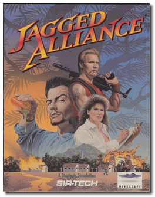
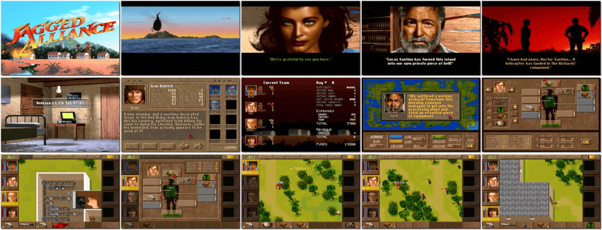

# Jagged Alliance

> ❝ The island of Metavira is invaluable as the only known source of the Fallow tree, whose sap is a vital ingredient in a precious medicinal sap. As the tree is seedless and cannot reproduce, the limited quantity of sap is of great concern. Jack and Brenda Richards, a father and daughter scientist team, are dedicated to researching the delicate procedure necessary to tap the trees and finding a cure for its infertility. Lucas Santino, a once trusted fellow researcher, now traitorous, has his agenda. Motivated by greed, Santino seeks to control the only source of the Fallow tree's sap and has nearly succeeded in taking over the island. Jack and Brenda turn to you, a person with connections to A.I.M. (the Association of International Mercenaries), their only hope of regaining control of the island. ❞
>
> ❝ This game **is not abandonware 🚫** and is still for sale on [GOG 💰](https://www.gog.com/en/game/jagged_alliance), [Steam 💰](https://store.steampowered.com/app/283270/Jagged_Alliance_1_Gold_Edition/) (**Gold Edition** includes Deadly Games), and [Zoom 💰](https://www.zoom-platform.com/product/jagged-alliance). ❞
>

📌 ┃ Year: **1995** ┃ Genre: **Role-playing • Strategy** ┃ Platform: **DOS** ┃ License: **Proprietary** ┃ Category: **Top-down • Turn-based • Tactical RPG • Contemporary** ┃ Media: **CD-ROM** ┃ **Patched** 

📦 ┃ **[DOSBox](https://www.dosbox.com/) 🟩** ┃ **[DOSBox Staging](https://dosbox-staging.github.io/) 🟩** ┃ **[DOSBox-X](https://dosbox-x.com/) 🟩** 

📎 ┃ **[Wikipedia](https://en.wikipedia.org/wiki/Jagged_Alliance)** ┃ **[Wikipedia - Jagged Alliance Series](https://en.wikipedia.org/wiki/Jagged_Alliance_(series))** ┃ **[MobyGames](https://www.mobygames.com/game/1038/jagged-alliance/)** ┃ **[AbandonwareDOS](https://www.abandonwaredos.com/abandonware-game.php?abandonware=Jagged+Alliance&gid=2213)** ┃ **[MyAbandonware](https://www.myabandonware.com/game/jagged-alliance-33e)** ┃ **[Jagged Alliance Fandom](https://jaggedalliance.fandom.com/wiki/Jagged_Alliance)** ┃ **[GOG 💰](https://www.gog.com/en/game/jagged_alliance)** ┃ Gold Edition: **[Steam 💰](https://store.steampowered.com/app/283270/Jagged_Alliance_1_Gold_Edition/)** ┃ **[Zoom 💰](https://www.zoom-platform.com/product/jagged-alliance)** 

## Installation Notes
- Select **Install game files**.
- Select **Optimized Installation Gain extra speed (39MB)**.
- Select **Install introduction sequence (needs 13MB more)**.
- Use the default **drive** and **directory** for the installation location.
- Sound Card Setup Program:
  - Select Card for Digital Sound: **Sound Blaster 16/AWE-32**, Auto-Detect Card: **Yes**.
  - Select Card for Music: **Sound Blaster Pro/16**, Auto-Detect Card: **Yes**.
  - Turn Subtitle Text On/Off: **Yes**.
  - **Save Settings** and **Exit to DOS**.

