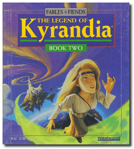
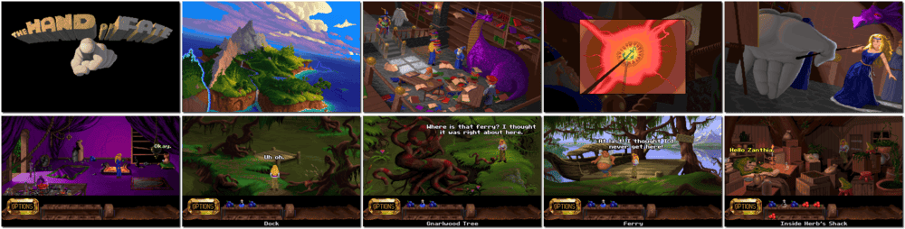

# The Legend of Kyrandia - Book Two: Hand of Fate

「**Fables & Fiends: Hand of Fate**」「**Kyrandia 2**」「**Kyrandia II: The Hand of Fate**」「**The Legend of Kyrandia: Hand of Fate**」

> ❝ Now you see it. Now you don’t. The land of Kyrandia is disappearing piece by piece. You are the offbeat, young mystic who must voyage to the centre of the world to break the curse and save it. Your surreal journey will twist even the sharpest of minds. Travelling through a vast, weirdly beautiful terrain, you must concoct potions, cast spells, and lure the help of some very bizarre inhabitants to uncover the secrets that doom Kyrandia. ❞
>
> ❝ This game **is not abandonware 🚫** and is still for sale on [GOG 💰](https://www.gog.com/en/game/legend_of_kyrandia_hand_of_fate). ❞
>

📌 ┃ **Year** ‣ 1993 ┃ **Genre** ‣ Adventure ┃ **Platform** ‣ DOS ┃ **License** ‣ Proprietary ┃ **Category** ‣ 3rd-person • Graphic adventure • Puzzle elements • Fantasy ┃ **Media** ‣ CD-ROM 

📦 ┃ **[DOSBox](https://www.dosbox.com/) 🟩** ┃ **[DOSBox Staging](https://dosbox-staging.github.io/) 🟩** ┃ **[DOSBox-X](https://dosbox-x.com/) 🟩** 

📎 ┃ **[Wikipedia](https://en.wikipedia.org/wiki/The_Legend_of_Kyrandia:_Hand_of_Fate)** ┃ **[MobyGames](https://www.mobygames.com/game/871/fables-fiends-hand-of-fate/)** ┃ **[AbandonwareDOS](https://www.abandonwaredos.com/abandonware-game.php?abandonware=Legend+of+Kyrandia+2%3A+Hand+of+fate&gid=1442)** ┃ **[MyAbandonware](https://www.myabandonware.com/game/fables-fiends-hand-of-fate-21z)** ┃ **[GOG 💰](https://www.gog.com/en/game/legend_of_kyrandia_hand_of_fate)** ┃ **Manual** ‣ [Games Database](https://www.gamesdatabase.org/game/microsoft-dos/legend-of-kyrandia-book-2-the-hand-of-fate) 

## Installation Notes
- Select preferred language.
- Use the default **drive** and **directory** for the installation location.
- Play music from: Select **3. Sound Blaster Pro / 16**.
- Play digitized samples? Select **1. Yes, play digitized samples.**

