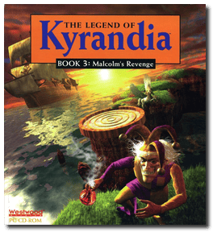
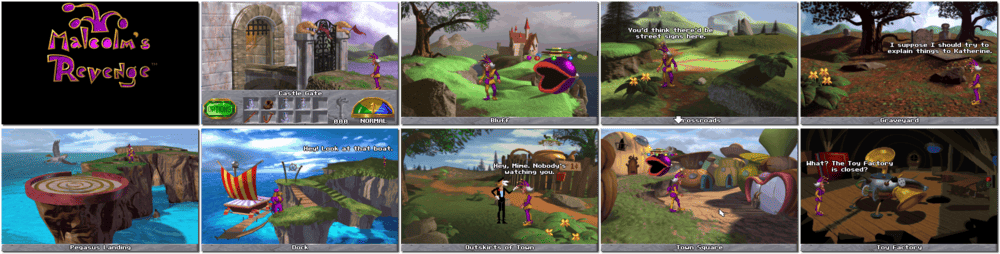

# The Legend of Kyrandia - Book Three: Malcolm's Revenge

「**Fables & Fiends: Malcolm's Revenge**」「**Kyrandia 3**」「**Kyrandia III: Malcolm's Revenge**」「**The Legend of Kyrandia: Malcolm's Revenge**」

> ❝ As punishment for the murder of Kyrandia's King and Queen, Malcolm, the warped court jester, was turned to stone. Years later, a freak accident has set him free to exact his sweet revenge, and you need to help him. Use magic, guile, cunning and devious disguises to explore the island of Kyrandia and beyond, from the Ends of the Earth to the Underworld. Discover the secrets of the Isle of Cats and the Cave of Wonder, and meet a cast of quirky characters: pugnacious pirates, the foolish Fish Cream Jerk, and the dead Queen Katherine. ❞
>
> ❝ This game **is not abandonware 🚫** and is still for sale on [GOG 💰](https://gog.com/en/game/legend_of_kyrandia_malcolms_revenge). ❞
>

📌 ┃ **Year** ‣ 1994 ┃ **Genre** ‣ Adventure ┃ **Platform** ‣ DOS ┃ **License** ‣ Proprietary ┃ **Media** ‣ CD-ROM 

📦 ┃ **[DOSBox](https://www.dosbox.com/) 🟩** ┃ **[DOSBox Staging](https://dosbox-staging.github.io/) 🟩** ┃ **[DOSBox-X](https://dosbox-x.com/) 🟩** 

📎 ┃ **[Wikipedia](https://en.wikipedia.org/wiki/The_Legend_of_Kyrandia:_Malcolm%27s_Revenge)** ┃ **[MobyGames](https://www.mobygames.com/game/872/the-legend-of-kyrandia-book-3-malcolms-revenge/)** ┃ **[MyAbandonware](https://www.myabandonware.com/game/the-legend-of-kyrandia-book-3-malcolm-s-revenge-2x5)** ┃ **[GOG 💰](https://gog.com/en/game/legend_of_kyrandia_malcolms_revenge)** 

## Installation Notes
- Select preferred language.
- Use the default **drive** and **directory** for the installation location.
- Would you like us to detect possible sound drivers for your sound card? Select **Yes**.
- Test and confirm the selected sound cards.

---

