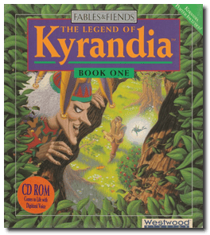
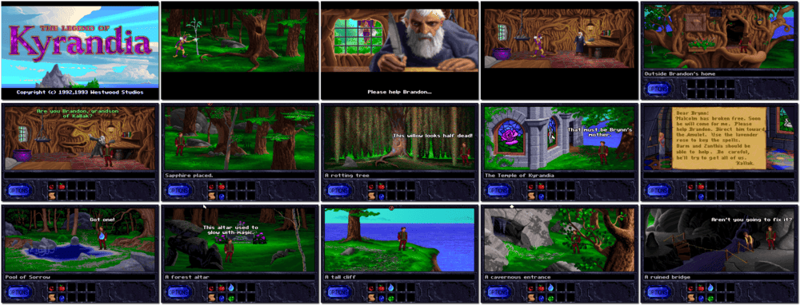

# The Legend of Kyrandia - Book One

「**Fables & Fiends: The Legend of Kyrandia**」「**Kyrandia 1**」

> ❝ Kyrandia is a land of mysterious forests and sleeping dragons. A fantasy land where rubies grow on trees and magic abounds. Who would imagine a land so idyllic would spawn a murderer so demented? Some say that court jester Malcolm was mad to begin with. His burning desire to possess the precious Kyragem slowly drove him to slay the peaceful King William. As the rightful prince of Kyrandia, you must pursue the elusive Malcolm to recover the powerful gemstone. Only then will you be able to reclaim the throne and restore harmony to the land of Kyrandia? The Legend of Kyrandia awaits you. ❞
>
> ❝ This game **is not abandonware 🚫** and is still for sale on [GOG 💰](https://www.gog.com/en/game/legend_of_kyrandia). ❞
>

📌 ┃ **Year** ‣ 1992 ┃ **Genre** ‣ Adventure ┃ **Platform** ‣ DOS ┃ **License** ‣ Proprietary ┃ **Category** ‣ 3rd-person • Graphic adventure • Puzzle elements • Fantasy ┃ **Media** ‣ CD-ROM 

📦 ┃ **[DOSBox](https://www.dosbox.com/) 🟩** ┃ **[DOSBox Staging](https://dosbox-staging.github.io/) 🟩** ┃ **[DOSBox-X](https://dosbox-x.com/) 🟩** 

📎 ┃ **[Wikipedia](https://en.wikipedia.org/wiki/The_Legend_of_Kyrandia)** ┃ **[MobyGames](https://www.mobygames.com/game/394/fables-fiends-the-legend-of-kyrandia-book-one/)** ┃ **[AbandonwareDOS](https://www.abandonwaredos.com/abandonware-game.php?abandonware=Legend+of+Kyrandia&gid=1427)** ┃ **[MyAbandonware](https://www.myabandonware.com/game/fables-fiends-the-legend-of-kyrandia-book-one-1rk)** ┃ **[GOG 💰](https://www.gog.com/en/game/legend_of_kyrandia)** ┃ **Manual** ‣ [Games Database](https://www.gamesdatabase.org/game/microsoft-dos/legend-of-kyrandia-book-1) 

## Installation Notes
- Select preferred language.
- Use the default **drive** and **directory** for the installation location.
- Setup Main Menu: Select **1. Setup IBM PC Compatibles**.
  - Please select your video system: Select **1. VGA 256k+ video RAM**.
  - Play sound from: Select **2. Sound Blaster**.
  - Play digitized samples from: Select **2. Sound Blaster**.
  - Do you want to use a mouse? Select **1. Yes, use a mouse.**
  - Select **3. Exit Setup** to start the game.

