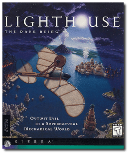
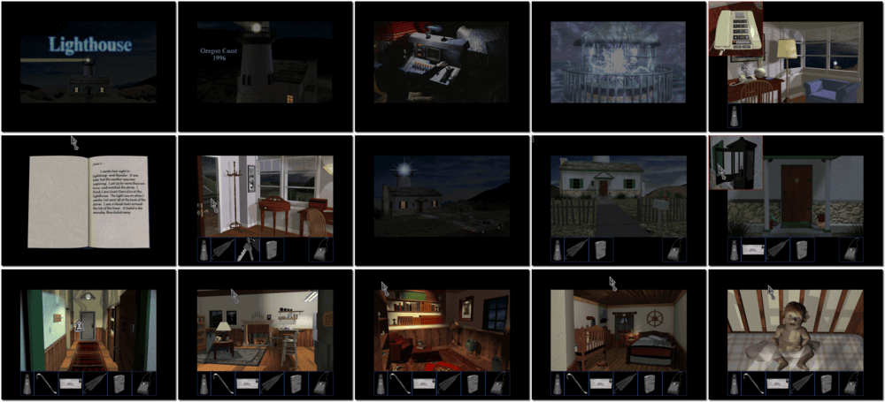

# Lighthouse: The Dark Being

> ❝ Pass through a shimmering portal into a world teeming with invention, discovery, and evil. Dark Being terrorized a parallel universe. Alien technology, unearthly treachery, and brain-twisting danger skulk around every craggy cliff and corner. Lives and worlds hang in the balance. Dr. Jeremiah Krick summoned you on a rescue mission. Do you have the courage and the imagination to leave your world and enter the unknown? You are the beacon of hope in a strange and barren world. ❞
>
> ❝ This game **is not abandonware 🚫** and is still for sale on [GOG 💰](https://gog.com/en/game/lighthouse_the_dark_being). ❞
>

📌 ┃ **Year** ‣ 1996 ┃ **Genre** ‣ Adventure ┃ **Platform** ‣ DOS ┃ **License** ‣ Proprietary ┃ **Media** ‣ CD-ROM ┃ **Patched** ‣ 2.0 

📦 ┃ **[DOSBox](https://www.dosbox.com/) 🟩** ┃ **[DOSBox Staging](https://dosbox-staging.github.io/) 🟩** ┃ **[DOSBox-X](https://dosbox-x.com/) 🟩** 

📎 ┃ **[Wikipedia](https://en.wikipedia.org/wiki/Lighthouse:_The_Dark_Being)** ┃ **[MobyGames](https://www.mobygames.com/game/266/lighthouse-the-dark-being/)** ┃ **[MyAbandonware](https://www.myabandonware.com/game/lighthouse-the-dark-being-3m3)** ┃ **[GOG 💰](https://gog.com/en/game/lighthouse_the_dark_being)** 

## Installation Notes
- Use the default **drive** and **directory** for the installation location.
- Select **Accept these choices and begin installation**.

## Additional Notes
- Mounted CD-ROM images at launch:
  1. Lighthouse: The Dark Being Disc #1
  2. Lighthouse: The Dark Being Disc #2

### How to swap CD-ROM images?
- [DOSBox](https://www.dosbox.com/wiki/DOSBox_FAQ#Swapping_CD_images) — Hotkey: CTRL+F4
- [DOSBox Staging](https://github.com/dosbox-staging/dosbox-staging/blob/main/README) — Hotkey: CTRL+F4 (or CMD+F4 on macOS)
- [DOSBox-X](https://dosbox-x.com/wiki/Guide%3AManaging-image-files-in-DOSBox%E2%80%90X#_mounting_multiple_cd_or_dvd_images) — Hotkey: F11+CTRL+C (or F12+D on macOS). Menu: DOS > Swap CD drive.

---

