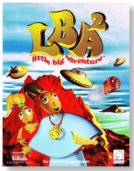
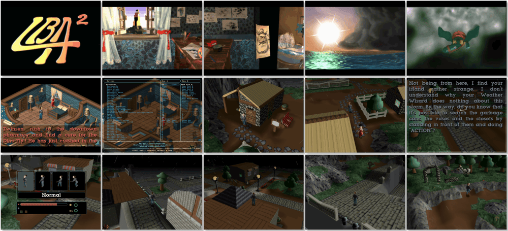

# Little Big Adventure 2

「**Twinsen's Odyssey**」「**Little Big Adventure 2: Twinsen's Odyssey**」「**Twinsen's Little Big Adventure 2 Classic**」「**LBA 2**」

> ❝ Twinsen, the plucky hero of Relentless, returns to face his greatest challenge ever. When strange aliens arrive from a neighbouring planet and begin kidnapping magicians and children, Twinsen uncovers an evil plot to obliterate his homeworld. In an epic adventure that will propel him across the galaxy, Twinsen must defeat the aliens and their evil god, the Dark Monk, and save his planet. ❞
>
> ❝ In October 2021 both Little Big Adventure 1 and 2 engines source code were released under the GPL. ❞ — *Wikipedia*
>
> ❝ The free original version is available on [GOG 🆓](https://www.gog.com/en/game/twinsens_little_big_adventure_2_classic_original_edition) and [Steam 🆓](https://store.steampowered.com/app/1857710/Twinsens_Little_Big_Adventure_2_Classic__Original_Edition/). The updated and enhanced version is available on [GOG 💰](https://www.gog.com/en/game/little_big_adventure_2) and [Steam 💰](https://store.steampowered.com/app/398000/Twinsens_Little_Big_Adventure_2_Classic/). ❞
>

📌 ┃ **Year** ‣ 1997 ┃ **Genre** ‣ Action • Adventure ┃ **Platform** ‣ DOS ┃ **License** ‣ Proprietary ┃ **Media** ‣ CD-ROM 

📦 ┃ **[DOSBox](https://www.dosbox.com/) 🟩** ┃ **[DOSBox Staging](https://dosbox-staging.github.io/) 🟩** ┃ **[DOSBox-X](https://dosbox-x.com/) 🟩** 

📎 ┃ **[Wikipedia](https://en.wikipedia.org/wiki/Little_Big_Adventure_2)** ┃ **[MobyGames](https://www.mobygames.com/game/1765/twinsens-odyssey/)** ┃ **[MyAbandonware](https://www.myabandonware.com/game/twinsen-s-odyssey-400)** ┃ **Twinsen's Little Big Adventure 2 Classic - Original Edition** ‣ [GOG 🆓](https://www.gog.com/en/game/twinsens_little_big_adventure_2_classic_original_edition) • [Steam 🆓](https://store.steampowered.com/app/1857710/Twinsens_Little_Big_Adventure_2_Classic__Original_Edition/) ┃ **Twinsen's Little Big Adventure 2 Classic** ‣ [GOG 💰](https://www.gog.com/en/game/little_big_adventure_2) • [Steam 💰](https://store.steampowered.com/app/398000/Twinsens_Little_Big_Adventure_2_Classic/) 

## Installation Notes
- Select your preferred language.
- Select **Hard Disk Installation (55674 K)**.
- Use the default **drive** and **directory** for the installation location.
- Select **Attempt to configure automatically**.
- Game options:
  - Check **Keep voices on Hard Disk**.
  - Select **Copy music files on hard disk (58263 K)**.
- Select **Quit** to start the game.

---

