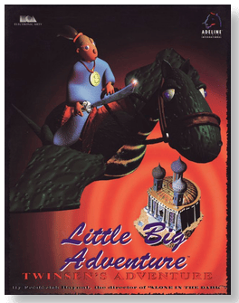
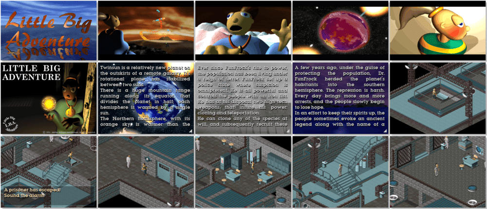

# Little Big Adventure

「**Relentless: Twinsen's Adventure**」「**Little Big Adventure: Twinsen's Adventure**」「**LBA**」

> ❝ Chilling dreams of destruction and doom fill your mind. You feel compelled to warn the world. In doing so, the tyrannous Dr. Funfrock imprisoned you. Are you in prison because of a dream? You know in your soul that you must escape somehow and discover the meaning behind this mystery. As Twinsen, prophet and saviour, you embark on a surreal and suspenseful journey. You cross continents to save the world and stop your evil nemesis. Your enemies may overtake you at any moment. Relentless you must be, for only those who remain pure can overcome the peril that awaits. ❞
>
> ❝ In October 2021 both Little Big Adventure 1 and 2 engines source code were released under the GPL. ❞ — *Wikipedia*
>
> ❝ The free original version is available on [GOG 🆓](https://www.gog.com/en/game/twinsens_little_big_adventure_classic_original_edition) and [Steam 🆓](https://store.steampowered.com/app/1857700/Twinsens_Little_Big_Adventure_Classic__Original_Edition/). The updated and enhanced version is available on [GOG 💰](https://www.gog.com/en/game/little_big_adventure) and [Steam 💰](https://store.steampowered.com/app/397330/Twinsens_Little_Big_Adventure_Classic/). ❞
>

📌 ┃ **Year** ‣ 1994 ┃ **Genre** ‣ Action • Adventure ┃ **Platform** ‣ DOS ┃ **License** ‣ Proprietary ┃ **Media** ‣ CD-ROM 

📦 ┃ **[DOSBox](https://www.dosbox.com/) 🟩** ┃ **[DOSBox Staging](https://dosbox-staging.github.io/) 🟩** ┃ **[DOSBox-X](https://dosbox-x.com/) 🟩** 

📎 ┃ **[Wikipedia](https://en.wikipedia.org/wiki/Little_Big_Adventure)** ┃ **[MobyGames](https://www.mobygames.com/game/748/relentless-twinsens-adventure/)** ┃ **[MyAbandonware](https://www.myabandonware.com/game/relentless-twinsen-s-adventure-25g)** ┃ **Twinsen's Little Big Adventure Classic - Original Edition** ‣ [GOG 🆓](https://www.gog.com/en/game/twinsens_little_big_adventure_classic_original_edition) • [Steam 🆓](https://store.steampowered.com/app/1857700/Twinsens_Little_Big_Adventure_Classic__Original_Edition/) ┃ **Twinsen's Little Big Adventure Classic** ‣ [GOG 💰](https://www.gog.com/en/game/little_big_adventure) • [Steam 💰](https://store.steampowered.com/app/397330/Twinsens_Little_Big_Adventure_Classic/) 

## Installation Notes
- Select your preferred language.
- Select **Hard Disk Installation**.
- Use the default **drive** and **directory** for the installation location.
- Main Menu:
  - Video Card Configuration: **S3 Incorporated Chipset**.
  - Music Sound Card Configuration: **Sound Blaster Pro 1 (OPL2)**; Address: **220h**.
  - FX Sound Card Configuration: **Sound Blaster Pro 1**; Address: **220h**; IRQ: **7**; DMA Channel: **1**.
  - Speech Configuration:
    - Keep Speech Files on Hard Disk - **YES**.
  - Save parameters.
  - Select **Quit to DOS** to start the game.

---

