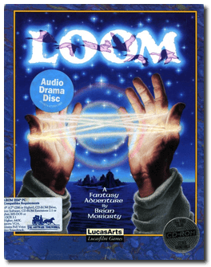
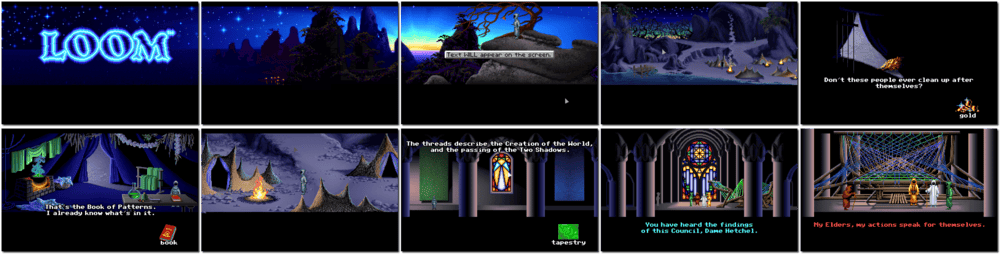

# Loom

> ❝ Long after the passing of the Second Shadow, when dragons ruled the twilight sky and the stars were bright and numerous, came the Age of the Great Guilds. Blacksmiths, Shepherds, Clerics. Each dedicates themself to the absolute control of secret knowledge. Another such Guild was the Weavers. Over the centuries, their craft transcended the limits of physical cloth - until they wove the very fabric of reality itself. Now, a strange power has swept the Weavers into oblivion, leaving behind one Weaver boy to unravel the mystery. Help young Bobbin rescue his Guild. You might save the Universe from an unspeakable catastrophe. ❞
>
> ❝ This game **is not abandonware 🚫** and is still for sale on [GOG 💰](https://gog.com/en/game/loom) and [Steam 💰](https://store.steampowered.com/app/32340/LOOM/). ❞
>

📌 ┃ **Year** ‣ 1990 ┃ **Genre** ‣ Adventure ┃ **Platform** ‣ DOS ┃ **License** ‣ Proprietary ┃ **Media** ‣ CD-ROM 

📦 ┃ **[DOSBox](https://www.dosbox.com/) 🟩** ┃ **[DOSBox Staging](https://dosbox-staging.github.io/) 🟩** ┃ **[DOSBox-X](https://dosbox-x.com/) 🟩** 

📎 ┃ **[Wikipedia](https://en.wikipedia.org/wiki/Loom_(video_game))** ┃ **[MobyGames](https://www.mobygames.com/game/176/loom/)** ┃ **[MyAbandonware](https://www.myabandonware.com/game/loom-xw)** ┃ **[GOG 💰](https://gog.com/en/game/loom)** ┃ **[Steam 💰](https://store.steampowered.com/app/32340/LOOM/)** 

---

