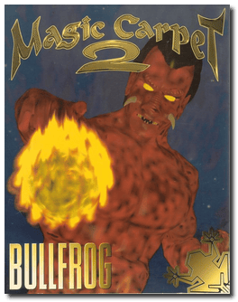
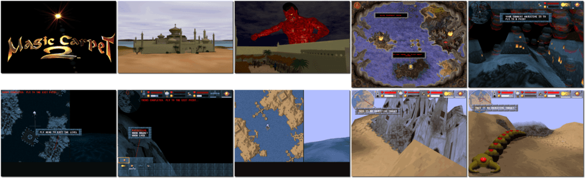

# Magic Carpet 2: The Netherworlds

「**Magic Carpet 2**」

> ❝ Absolute Darkness enshrouds the city, revealing a gateway to indescribable evil. Through this portal, you must descend to defeat the Demon Lord and his minions. Once more, your fate is sealed by the Demon as you unfurl the magic carpet and battle hordes of vile creatures to purge the Netherworlds of evil. ❞
>
> ❝ This game **is not abandonware 🚫** and is still for sale on [GOG 💰](https://www.gog.com/en/game/magic_carpet_2_the_netherworlds). ❞
>

📌 ┃ **Year** ‣ 1995 ┃ **Genre** ‣ Action ┃ **Platform** ‣ DOS ┃ **License** ‣ Proprietary ┃ **Category** ‣ 1st-person • Shooter • Flight • Fantasy ┃ **Media** ‣ CD-ROM 

📦 ┃ **[DOSBox](https://www.dosbox.com/) 🟩** ┃ **[DOSBox Staging](https://dosbox-staging.github.io/) 🟩** ┃ **[DOSBox-X](https://dosbox-x.com/) 🟩** 

📎 ┃ **[Wikipedia](https://en.wikipedia.org/wiki/Magic_Carpet_2)** ┃ **[MobyGames](https://www.mobygames.com/game/790/magic-carpet-2-the-netherworlds/)** ┃ **[AbandonwareDOS](https://www.abandonwaredos.com/abandonware-game.php?abandonware=Magic+Carpet+2%3A+The+Netherworlds&gid=2966)** ┃ **[MyAbandonware](https://www.myabandonware.com/game/magic-carpet-2-the-netherworlds-2w2)** ┃ **[GOG 💰](https://www.gog.com/en/game/magic_carpet_2_the_netherworlds)** 

## Installation Notes
- Select and configure MIDI music driver: **Creative Labs Sound Blaster(TM) 16** (*Attempt to configure sound driver automatically*).
- Select and configure digital audio driver: **Creative Labs Sound Blaster 16 or AWE32** (*Attempt to configure sound driver automatically*).

## Additional Notes
- Press `R` in-game to switch to 640x480 VGA mode.

