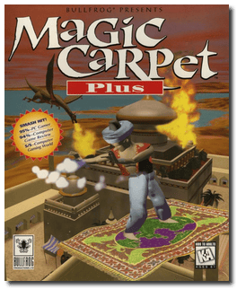
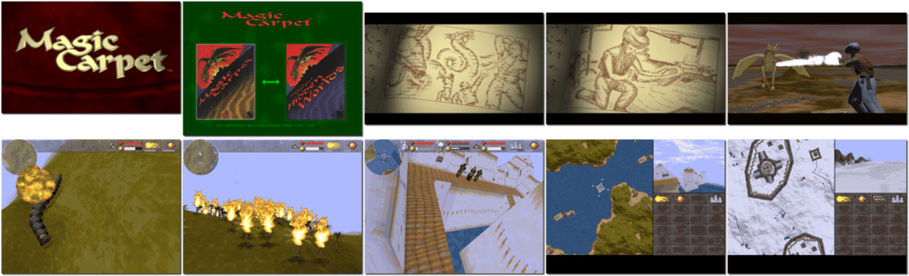

# Magic Carpet Plus

「**Magic Carpet**」「**Magic Carpet DX**」「**Magic Carpet: Hidden Worlds**」

> ❝ You're flying just feet above real landscapes. There's a dragon in front of you, kilter crabs behind and some guy on another carpet cutting you to ribbons. Not enough power for the accelerate spell. Damn. Looks like you're going to have to fight this one out. ❞
>
> ❝ This game **is not abandonware 🚫** and is still for sale on [GOG 💰](https://www.gog.com/en/game/magic_carpet). ❞
>

📌 ┃ **Year** ‣ 1995 ┃ **Genre** ‣ Action ┃ **Platform** ‣ DOS ┃ **License** ‣ Proprietary ┃ **Category** ‣ 1st-person • Shooter • Flight • Fantasy ┃ **Media** ‣ CD-ROM ┃ **Compilation** 

📦 ┃ **[DOSBox](https://www.dosbox.com/) 🟩** ┃ **[DOSBox Staging](https://dosbox-staging.github.io/) 🟩** ┃ **[DOSBox-X](https://dosbox-x.com/) 🟩** 

📎 ┃ **[Wikipedia](https://en.wikipedia.org/wiki/Magic_Carpet_(video_game))** ┃ **MobyGames** ‣ [Magic Carpet Plus](https://www.mobygames.com/game/15665/magic-carpet-plus/) • [Magic Carpet](https://www.mobygames.com/game/361/magic-carpet/) • [Magic Carpet: Hidden Worlds](https://www.mobygames.com/game/738/magic-carpet-the-hidden-worlds/) ┃ **[AbandonwareDOS](https://www.abandonwaredos.com/abandonware-game.php?abandonware=Magic+Carpet&gid=1491)** ┃ **MyAbandonware** ‣ [Magic Carpet Plus](https://www.myabandonware.com/game/magic-carpet-plus-2f5) • [Magic Carpet](https://www.myabandonware.com/game/magic-carpet-2f4) ┃ **[GOG 💰](https://www.gog.com/en/game/magic_carpet)** 

## Additional Notes
- First time setup:
  - Sound source: **SoundBlaster 16**.
  - Music source: **SoundBlaster 16 FM**.
  - Sound I/O: **220**.
  - Sound IRQ: **7**.
  - Sound DMA: **1**.
  - Yes/No: **Yes**.
- Press `R` in-game to switch to 640x480 VGA mode (also prevents the game from going too fast).
- When the game runs too fast or too slow, you can cycle up or down to adjust the speed: [DOSBox Special Keys](https://www.dosbox.com/wiki/Special_Keys).

