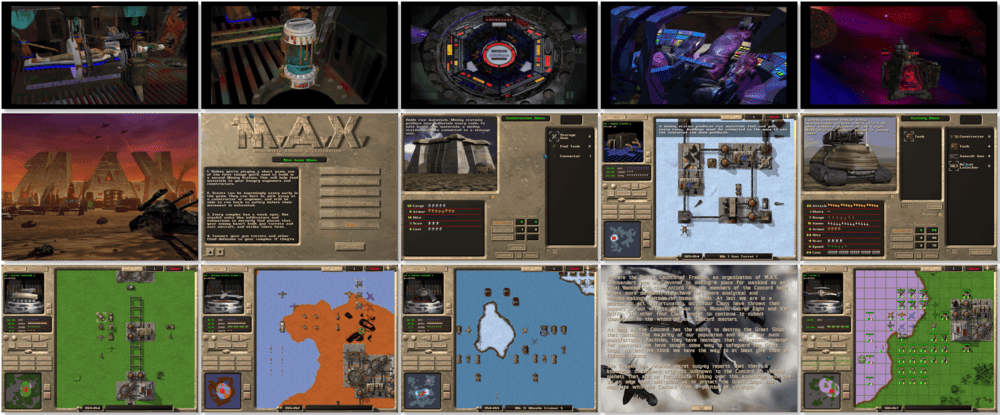

# Mechanized Assault & Exploration

「**M.A.X.**」「**M.A.X.: Mechanized Assault & Exploration**」

> ❝ Your mission: colonize new worlds on distant planets. As the Mission Commander of the Mechanized Assault & Exploration (M.A.X.) force, you are the first. Mining stations, power plants, tactical combat vehicle factories, habitats – it's up to you to plan and construct them. You create an entire new colony. You control the resources you find there. Enemies? Crush them! And there will be enemies. You're not the only Mission Commander trying to colonize the planets. You'll have to push yourself to the limit to survive the ultimate showdown in strategic warfare. It's espionage, heavy artillery, offensives, counter-offensives and intelligence, all with maximum consequences. ❞
>
> ❝ This game **is not abandonware 🚫** and is still for sale on [Steam 💰](https://store.steampowered.com/app/615250/MAX_Mechanized_Assault__Exploration/). A **M.A.X. + M.A.X. 2** bundle is available on [GOG 💰](https://www.gog.com/en/game/m_a_x_m_a_x_2). ❞
>

📌 ┃ **Year** ‣ 1996 ┃ **Genre** ‣ Strategy ┃ **Platform** ‣ DOS ┃ **License** ‣ Proprietary ┃ **Media** ‣ CD-ROM ┃ **Patched** ‣ 1.04 

📦 ┃ **[DOSBox](https://www.dosbox.com/) 🟩** ┃ **[DOSBox Staging](https://dosbox-staging.github.io/) 🟩** ┃ **[DOSBox-X](https://dosbox-x.com/) 🟩** 

📎 ┃ **[Wikipedia](https://en.wikipedia.org/wiki/Mechanized_Assault_%26_Exploration)** ┃ **[MobyGames](https://www.mobygames.com/game/2180/max-mechanized-assault-exploration/)** ┃ **[MyAbandonware](https://www.myabandonware.com/game/m-a-x-mechanized-assault-exploration-d6b)** ┃ **[Steam 💰](https://store.steampowered.com/app/615250/MAX_Mechanized_Assault__Exploration/)** ┃ **M.A.X. + M.A.X. 2** ‣ [GOG 💰](https://www.gog.com/en/game/m_a_x_m_a_x_2) 

## Installation Notes
- Select your preferred language.
- Select **Full Installation -- 398.72 Mb**.
- Use the default **drive** and **directory** for the installation location.
- Select **Install MAX**.
- Main menu:
  - Select **Auto Detect Sound Hardware** • **Continue with Auto Detection** • **Select this sound card**.
  - Select **Exit**. Save changes? **Yes**.
- Unskippable game trailer will play before the actual game starts.

---

