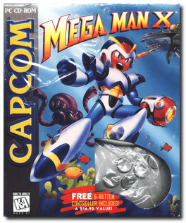
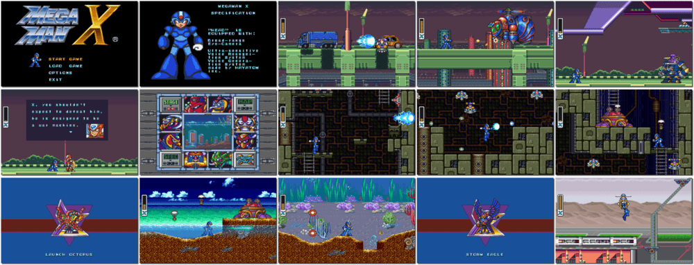

# Mega Man X

「**Rockman X**」

> ❝ Near the end of his life, Dr. Light succeeds in creating the first of a new series of robots that will change the world. Able to think and make decisions, this new robot holds great danger and possibilities. Fearful of the possible consequences of unleashing his creation on the World, Dr. Light decides to seal him in a capsule and test his systems until they are reliable. The future will have to choose his fate. ❞
>
> ❝ This game **is not abandonware 🚫**. The **Mega Man X Legacy Collection** release is available on [Steam 💰](https://store.steampowered.com/app/743890/Mega_Man_X_Legacy_Collection/). ❞
>

📌 ┃ **Year** ‣ 1995 ┃ **Genre** ‣ Action ┃ **Platform** ‣ DOS ┃ **License** ‣ Proprietary ┃ **Media** ‣ CD-ROM ┃ **No Manual** 

📦 ┃ **[DOSBox](https://www.dosbox.com/) 🟩** ┃ **[DOSBox Staging](https://dosbox-staging.github.io/) 🟩** ┃ **[DOSBox-X](https://dosbox-x.com/) 🟩** 

📎 ┃ **[Wikipedia](https://en.wikipedia.org/wiki/Mega_Man_X_(video_game))** ┃ **[MobyGames](https://www.mobygames.com/game/1334/mega-man-x/)** ┃ **[MyAbandonware](https://www.myabandonware.com/game/mega-man-x-2wh)** ┃ **[Fandom](https://megaman.fandom.com/wiki/Mega_Man_X_(video_game))** ┃ **[Series](https://en.wikipedia.org/wiki/Mega_Man_X)** ┃ **Mega Man X Legacy Collection** ‣ [Steam 💰](https://store.steampowered.com/app/743890/Mega_Man_X_Legacy_Collection/) 

## Installation Notes
- Use the default **drive** and **directory** for the installation location.
  - Select **ACCEPT CONFIGURATION**.
- Select and configure MIDI music driver: **Creative Labs Sound Blaster(TM) 16** (*Attempt to configure sound driver automatically*).
- Select and configure digital audio driver: **Creative Labs Sound Blaster 16 or AWE32** (*Attempt to configure sound driver automatically*).

---

