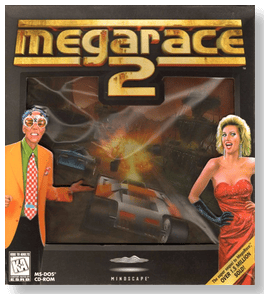

# MegaRace 2

> ❝ 3D Arcade racing game. It's faster, more furious and far superior to anything before. Lance Boyle is back with a beautiful assistant! It features improved video streaming technology, more complex multi-laned and multi-path track designs, and realistic 3D-rendered vehicles and obstacles. A new assortment of visually satisfying weaponry brings additional punch to the program. SVGA graphics, FMV and a real-time rendered 3-D environment. If you can't drive, you won't survive - Let's burn some rubber! ❞
>
> ❝ This game **is not abandonware 🚫** and is still for sale on [Steam 💰](https://store.steampowered.com/app/733760/MegaRace_2/) and [Zoom 💰](https://www.zoom-platform.com/product/megarace-2). The **MegaRace 1+2** bundle is available on [GOG 💰](https://gog.com/en/game/megarace_1_2). ❞
>

📌 ┃ **Year** ‣ 1996 ┃ **Genre** ‣ Racing ┃ **Platform** ‣ DOS ┃ **License** ‣ Proprietary ┃ **Media** ‣ CD-ROM 

📦 ┃ **[DOSBox](https://www.dosbox.com/) 🟩** ┃ **[DOSBox Staging](https://dosbox-staging.github.io/) 🟩** ┃ **[DOSBox-X](https://dosbox-x.com/) 🟩** 

📎 ┃ **[Wikipedia](https://en.wikipedia.org/wiki/MegaRace_2)** ┃ **[MobyGames](https://www.mobygames.com/game/1049/megarace-2/)** ┃ **[MyAbandonware](https://www.myabandonware.com/game/megarace-2-d0e)** ┃ **[Steam 💰](https://store.steampowered.com/app/733760/MegaRace_2/)** ┃ **[Zoom 💰](https://www.zoom-platform.com/product/megarace-2)** ┃ **MegaRace 1+2** ‣ [GOG 💰](https://www.gog.com/en/game/megarace_1_2) 

## Installation Notes
- Click **Start** on the bottom right corner to start the installation.

## Additional Notes
- Mounted CD-ROM images at launch:
  1. MegaRace 2 Disc #1
  2. MegaRace 2 Disc #2

### How to swap CD-ROM images?
- [DOSBox](https://www.dosbox.com/wiki/DOSBox_FAQ#Swapping_CD_images) — Hotkey: CTRL+F4
- [DOSBox Staging](https://github.com/dosbox-staging/dosbox-staging/blob/main/README) — Hotkey: CTRL+F4 (or CMD+F4 on macOS)
- [DOSBox-X](https://dosbox-x.com/wiki/Guide%3AManaging-image-files-in-DOSBox%E2%80%90X#_mounting_multiple_cd_or_dvd_images) — Hotkey: F11+CTRL+C (or F12+D on macOS). Menu: DOS ‣ Swap CD drive.

---

