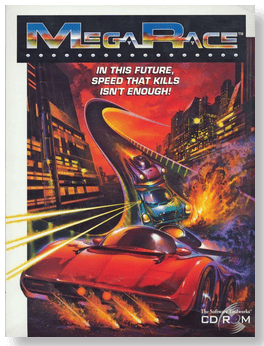
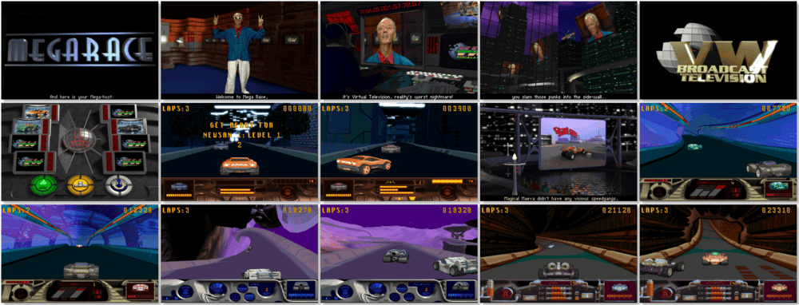

# MegaRace

> ❝ This race is so full of sound and fury, so graphic and realistic that you will squirm in your seat as you squeal around futuristic 3-0 cities in custom war wagons loaded with weapons. You'll have so much fun so fast it will make your head spin. Remember, your life depends on speed, cunning, and aggression. And you're going to need them all. You can't avoid tricky scum like Hammerhead and King Kool as their gangs try to take you out. But if you knock them off first, you can grab their guns and get going on the ride of your life. It's do or die. You haven't seen anything like this because there's never been anything like MegaRace. Strap yourself into this brave new world of battle racing and take it to the limit! ❞
>
> ❝ This game **is not abandonware 🚫** and is still for sale on [Steam 💰](https://store.steampowered.com/app/730580/MegaRace_1/) and [Zoom 💰](https://www.zoom-platform.com/product/megarace-1). The **MegaRace 1+2** bundle is available on [GOG 💰](https://gog.com/en/game/megarace_1_2). ❞
>

📌 ┃ **Year** ‣ 1994 ┃ **Genre** ‣ Action • Racing ┃ **Platform** ‣ DOS ┃ **License** ‣ Proprietary ┃ **Media** ‣ CD-ROM ┃ **Patched** ‣ 1.1 

📦 ┃ **[DOSBox](https://www.dosbox.com/) 🟩** ┃ **[DOSBox Staging](https://dosbox-staging.github.io/) 🟩** ┃ **[DOSBox-X](https://dosbox-x.com/) 🟩** 

📎 ┃ **[Wikipedia](https://en.wikipedia.org/wiki/MegaRace)** ┃ **[MobyGames](https://www.mobygames.com/game/592/megarace/)** ┃ **[MyAbandonware](https://www.myabandonware.com/game/megarace-42j)** ┃ **[Steam 💰](https://store.steampowered.com/app/730580/MegaRace_1/)** ┃ **[Zoom 💰](https://www.zoom-platform.com/product/megarace-1)** ┃ **MegaRace 1+2** ‣ [GOG 💰](https://gog.com/en/game/megarace_1_2) 

## Installation Notes
- Select **I want to start a new installation**.
- Select **Manual installation**.
- Use the default **drive** and **directory** for the installation location.
- Game configuration:
  - Language: **English subtitles**.
  - Graphics: **256 colors VGA**.
  - Music: **Sound Blaster 16** > **Auto**.
  - Sound: **Sound Blaster 16** > **Auto**.
  - Extra memory: **Expanded Memory (EMS)**.
- Select **I want to start the game now.**

## Additional Notes
- Calibrate keyboard controls before starting a race.
- Press `Ctrl + Q` to quit a race.

---

