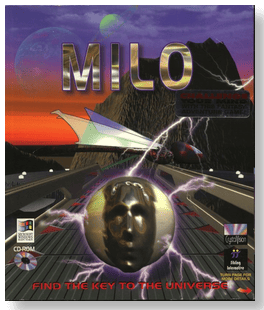
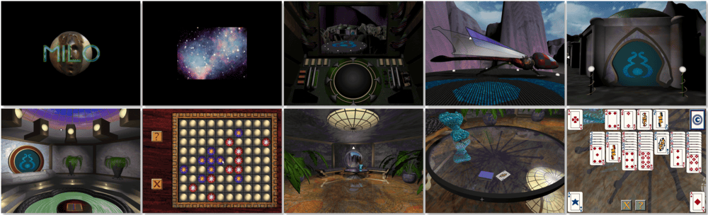

# Milo

> ❝ Long ago, an advanced Alien race discovered the key to the universe, a secret beyond human comprehension. What is left is a few incredible ruins and Milo, the android caretaker of the lost worlds. Milo has kept the ruins in good condition thanks to his advanced hyper-intelligent neural net. But he cannot go on forever. His artificial intelligence circuitry will fail if not challenged, and he's been left alone for too long. You have been brought to this place to challenge Milo. You must solve his tests and defeat him. Only then will he grant you the treasured keys to the universe? ❞
>

📌 ┃ **Year** ‣ 1996 ┃ **Genre** ‣ Adventure ┃ **Platform** ‣ Windows 3.1x ┃ **License** ‣ Abandonware ┃ **Media** ‣ CD-ROM 

📦 ┃ **[DOSBox](https://www.dosbox.com/) 🟩** ┃ **[DOSBox Staging](https://dosbox-staging.github.io/) 🟩** ┃ **[DOSBox-X](https://dosbox-x.com/) 🟩** 

📎 ┃ **[Wikipedia](https://en.wikipedia.org/wiki/Milo_(video_game))** ┃ **[MobyGames](https://www.mobygames.com/game/6908/milo/)** ┃ **[MyAbandonware](https://www.myabandonware.com/game/milo-fii)** 

## Installation Notes
- Use the default **drive** and **directory** for the installation location.
- Exit Windows and DOSBox once the installation is complete (**Program Manager ‣ File ‣ Exit Windows**) and rerun the `Launch` script to start the program.

---

